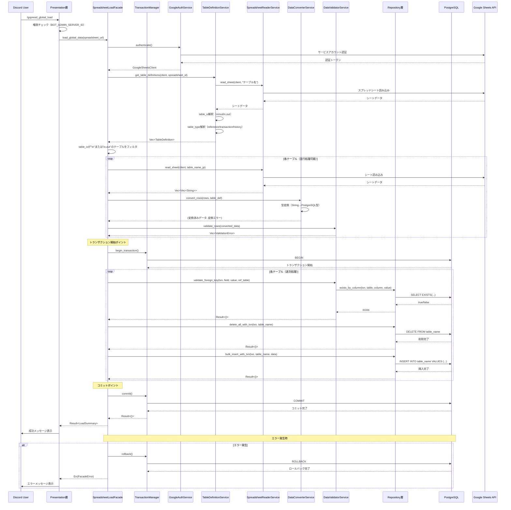
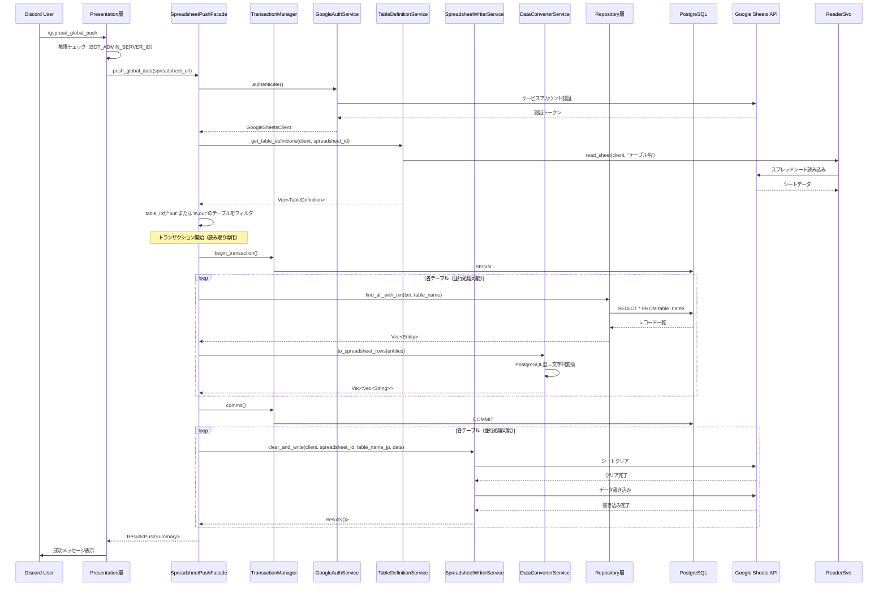
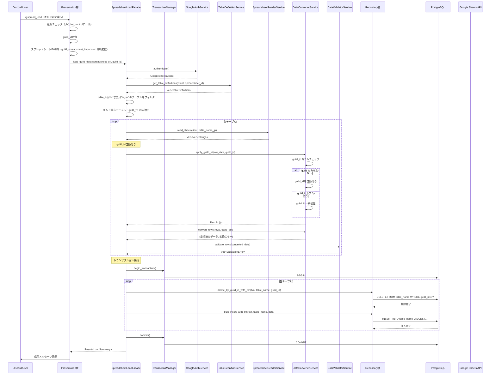
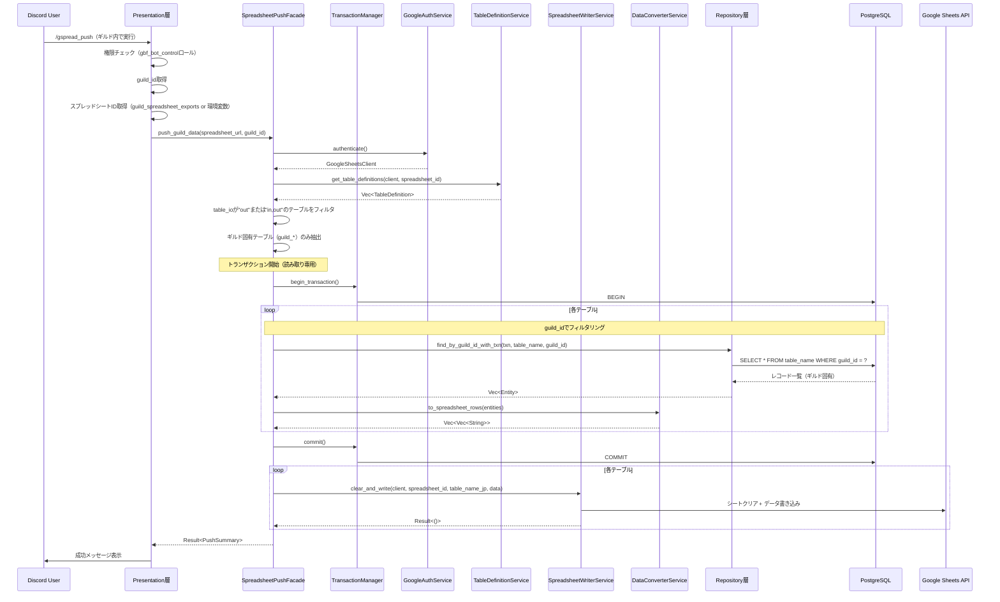
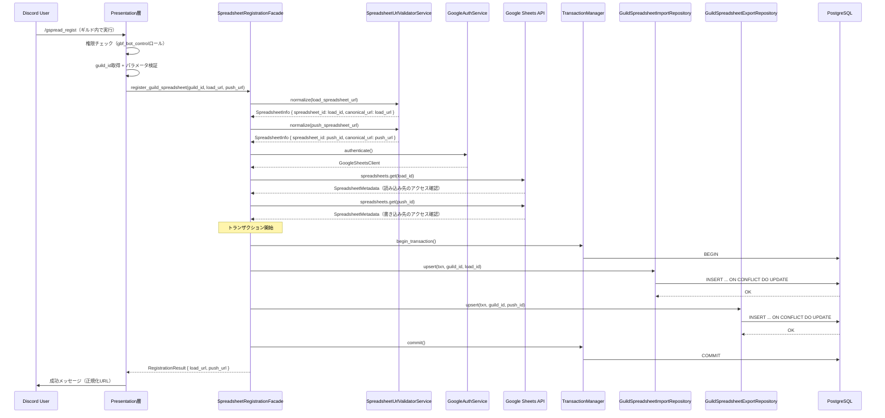

# スプレッドシート機能 データフロー設計書

## 概要

本設計書では、Googleスプレッドシート連携機能における主要なデータフロー（グローバルデータ読み込み・書き込み、ギルドデータ読み込み・書き込み、ギルドスプレッドシート登録）の全体像、各層の責務、トランザクション境界、エラーハンドリングポイント、並行処理設計を定義します。

## データフロー全体像

スプレッドシート機能は、以下の5つの主要なデータフローを持ちます：

1. **グローバルデータ読み込みフロー** (`/gspread_global_load`) - スプレッドシート → PostgreSQL
2. **グローバルデータ書き込みフロー** (`/gspread_global_push`) - PostgreSQL → スプレッドシート
3. **ギルドデータ読み込みフロー** (`/gspread_load`) - スプレッドシート → PostgreSQL（guild_id自動付与）
4. **ギルドデータ書き込みフロー** (`/gspread_push`) - PostgreSQL → スプレッドシート（guild_idフィルタリング）
5. **ギルドスプレッドシート登録フロー** (`/gspread_regist`) - Discord → PostgreSQL（guild_spreadsheet_imports / guild_spreadsheet_exports更新）

### アーキテクチャ層構成

```
Presentation層 (events)
    ↓
Facade層 (facades)
    ↓
Service層 (services)
    ↓
Repository層 (repository)
    ↓
PostgreSQL / Google Sheets API
```

---

## グローバルデータ読み込みフロー

### 概要

Bot管理者専用サーバーで実行される全ギルド共通マスターデータの読み込み処理。

### シーケンス図



### 各層の責務

#### Presentation層（events）

- **権限チェック**: BOT_ADMIN_SERVER_IDで実行サーバーを検証
- **スプレッドシートURL取得**: 環境変数からURL取得
- **Facade層呼び出し**: SpreadsheetLoadFacadeの呼び出し
- **結果のフォーマット**: ユーザーへの成功/失敗メッセージ表示

#### Facade層（SpreadsheetLoadFacade）

- **トランザクション管理**: begin/commit/rollbackの責任
- **Service層協調**: 複数Serviceを組み合わせてユースケース実現
- **外部キー検証**: トランザクション内での外部キー制約確認
- **エラーハンドリング**: Service層エラーの集約とロールバック制御

#### Service層

- **GoogleAuthService**: Google認証、クライアント提供
- **TableDefinitionService**: テーブル定義解析、table_io/table_type解釈
- **SpreadsheetReaderService**: Google Sheets APIからのデータ読み込み
- **DataConverterService**: 文字列→PostgreSQL型変換
- **DataValidatorService**: バリデーション、外部キー制約検証

#### Repository層

- **データ削除**: トランザクション内でのDELETEクエリ実行
- **バルクインサート**: トランザクション内でのINSERTクエリ実行
- **外部キー存在確認**: 参照先テーブルの存在確認クエリ実行

### トランザクション境界

**トランザクション開始タイミング**:
- 全テーブルのデータ変換・バリデーション完了後
- 外部キー検証の直前

**トランザクション内処理**:
1. 外部キー制約検証（各テーブル）
2. 既存データ削除（各テーブル）
3. 新データ挿入（各テーブル）

**コミット条件**:
- 全テーブルの削除・挿入が成功

**ロールバック条件**:
- 外部キー検証失敗
- データ削除失敗
- データ挿入失敗
- DB接続エラー

### エラーハンドリングポイント

| エラーポイント | エラー型 | ハンドリング |
|------------|---------|------------|
| 権限チェック失敗 | PresentationError | ユーザーにエラーメッセージ表示 |
| Google認証失敗 | ExternalServiceError | ロールバック不要、ユーザーに通知 |
| シート読み込み失敗 | ExternalServiceError | ロールバック不要、ユーザーに通知 |
| データ変換エラー | ValidationError | エラー行をスキップ、ログ記録 |
| 外部キー検証失敗 | ValidationError | トランザクションロールバック |
| DB操作失敗 | RepositoryError | トランザクションロールバック |

### 並行処理設計

**並行処理可能な箇所**:
1. **テーブルごとのシート読み込み**: 独立したテーブルは並行読み込み可能
2. **データ変換**: 各テーブルのデータ変換は並行処理可能

```rust
// 並行処理の実装例
use futures::future::try_join_all;

let read_futures = table_defs
    .iter()
    .map(|table_def| async move {
        let sheet_data = reader_service.read_sheet(client, spreadsheet_id, &table_def.table_name_jp).await?;
        let (converted, errors) = converter_service.convert_rows(sheet_data, table_def);
        Ok((table_def, converted, errors))
    });

let results = try_join_all(read_futures).await?;
```

**逐次処理が必要な箇所**:
1. **トランザクション内のDB操作**: 外部キー制約の順序依存性を考慮
2. **外部キー検証**: 参照先テーブルのデータが先に挿入されている必要がある

---

## グローバルデータ書き込みフロー

### 概要

PostgreSQLのグローバルデータをスプレッドシートに書き出す処理。

### シーケンス図



### 各層の責務

#### Facade層

- **読み取りトランザクション管理**: データの一貫性確保
- **PostgreSQLデータ取得**: Repository層からの全データ取得
- **データ変換**: PostgreSQL型→スプレッドシート文字列変換
- **スプレッドシート書き込み**: WriterServiceを通じた書き込み

#### Service層

- **SpreadsheetWriterService**: スプレッドシートへの書き込み、シートクリア
- **DataConverterService**: PostgreSQL型→文字列変換

#### Repository層

- **全データ取得**: トランザクション内でのSELECTクエリ実行

### トランザクション境界

**トランザクション開始タイミング**:
- データ取得開始前

**トランザクション内処理**:
1. 各テーブルのデータ取得（SELECT）
2. データ変換（トランザクション外でも可）

**コミット条件**:
- 全データの取得完了

**ロールバック条件**:
- データ取得失敗

**注意点**:
- スプレッドシート書き込みはトランザクション外で実行（外部API呼び出しのため）
- 書き込み失敗時はユーザーに通知するが、DBロールバックは不要

---

## ギルドデータ読み込みフロー

### 概要

各ギルドが独自のスプレッドシートからギルド固有データを読み込む処理。guild_idの自動付与が特徴。

### シーケンス図



### 各層の責務

#### Presentation層

- **権限チェック**: gbf_bot_controlロール保持者のみ実行可能
- **guild_id取得**: 実行されたギルドのIDを取得
- **スプレッドシートID取得**: guild_spreadsheet_importsテーブルを参照（未登録時のみ環境変数をフォールバック）

#### Facade層

- **guild_id自動付与**: スプレッドシートにguild_idカラムがない場合、自動付与
- **ギルド固有テーブルフィルタ**: `guild_*`で始まるテーブルのみ処理
- **トランザクション管理**: ギルドIDによるスコープ付き削除・挿入

#### Service層

- **DataConverterService**: `apply_guild_id`メソッドでguild_id付与とバリデーション

#### Repository層

- **ギルドスコープ削除**: `DELETE FROM table WHERE guild_id = ?`
- **バルクインサート**: guild_idを含むデータの一括挿入

### guild_id自動付与のタイミング

**タイミング**: データ変換前、スプレッドシートデータ読み込み直後

**ロジック**:

```rust
pub fn apply_guild_id(
    row_data: &mut HashMap<String, String>,
    guild_id: i64,
    has_guild_id_column: bool,
) -> Result<(), ValidationError> {
    if !has_guild_id_column {
        // guild_idカラムがない場合、自動付与
        row_data.insert("guild_id".to_string(), guild_id.to_string());
        return Ok(());
    }

    // guild_idカラムがある場合、値を検証
    if let Some(value) = row_data.get("guild_id") {
        let parsed_guild_id = value.parse::<i64>()?;
        if parsed_guild_id != guild_id {
            return Err(ValidationError::GuildIdMismatch {
                expected: guild_id,
                actual: parsed_guild_id,
            });
        }
    }

    Ok(())
}
```

**3つのケース**:
1. **guild_idカラムなし**: 自動的にguild_idを付与
2. **guild_idカラムあり + 値一致**: 正常処理
3. **guild_idカラムあり + 値不一致**: `ValidationError::GuildIdMismatch`

---

## ギルドデータ書き込みフロー

### 概要

ギルド固有のPostgreSQLデータをスプレッドシートに書き出す処理。guild_idでフィルタリングしたデータのみ書き出す。

### シーケンス図



### 各層の責務

#### Facade層

- **guild_idフィルタリング**: ギルド固有データのみ取得
- **トランザクション管理**: 読み取り専用トランザクション

#### Repository層

- **ギルドスコープ検索**: `SELECT * FROM table WHERE guild_id = ?`

### guild_idフィルタリング

**フィルタリングポイント**: Repository層でのSELECTクエリ

```rust
pub async fn find_by_guild_id_with_txn(
    &self,
    txn: &DatabaseTransaction,
    table_name: &str,
    guild_id: i64,
) -> Result<Vec<Entity>, RepositoryError> {
    let query = format!("SELECT * FROM {} WHERE guild_id = ?", table_name);
    let entities = sqlx::query_as(&query)
        .bind(guild_id)
        .fetch_all(txn)
        .await?;

    Ok(entities)
}
```

**重要な点**:
- ギルド固有テーブル（`guild_*`）は必ず`guild_id`カラムを持つ
- 他のギルドのデータは一切取得しない
- スプレッドシートには当該ギルドのデータのみ書き込まれる

---

## ギルドスプレッドシート登録フロー

### 概要

`/gspread_regist`コマンドでギルド固有のスプレッドシートIDを登録し、読み込み用は`guild_spreadsheet_imports`、書き込み用は`guild_spreadsheet_exports`に保存するフロー。登録済みIDは`/gspread_load`および`/gspread_push`の前提条件となる。

### シーケンス図



### 各層の責務

#### Presentation層

- Slashコマンドオプション（読み込み用/書き込み用URL）の取得と最大文字数チェック
- `gbf_bot_control`ロールと`guild_id`の検証
- Facadeから戻った結果を整形し、ユーザー向けに日本語で通知

#### Facade層

- `SpreadsheetUrlValidatorService`によるURL正規化／ID抽出を実行
- `GoogleAuthService`でSheets APIクライアントを取得し、`spreadsheets.get`でアクセス権を確認
- `TransactionManager`でトランザクションを開始し、`GuildSpreadsheetImportRepository` / `GuildSpreadsheetExportRepository`への永続化処理を統括
- 例外を`FacadeError`→`PresentationError`へ変換し、ユーザーに伝達しやすい形に変換

#### Service層

- **SpreadsheetUrlValidatorService**: URL/ID形式チェックと正規化を担当
- **GuildSpreadsheetConfigService**: 読み込み/書き込みそれぞれのRepositoryを束ね、`upsert_load` `upsert_push` APIを提供

#### Repository層

- `GuildSpreadsheetImportRepository`: `guild_spreadsheet_imports`への`INSERT ... ON CONFLICT DO UPDATE`を提供
- `GuildSpreadsheetExportRepository`: `guild_spreadsheet_exports`への`INSERT ... ON CONFLICT DO UPDATE`を提供

### バリデーションとエラー

- **URL形式エラー**: `docs.google.com/spreadsheets/d/`以外のURL、ID長不足を検出し、ユーザーにフォーマット例を提示
- **権限不足**: Google Sheets APIで403/404を検出した場合は共有設定ミスを警告し、処理を中断
- **DB更新失敗**: `GuildSpreadsheetImportRepository` / `GuildSpreadsheetExportRepository`からの例外をFacadeで捕捉し、ロールバックして再実行を促す
- **同時実行**: 各テーブルのPK（`guild_id`）で自然排他されるが、Facade側でリトライポリシー（例: 3回まで）を検討

---

## トランザクション管理

### トランザクション開始タイミング

| フロー | トランザクション開始タイミング | 理由 |
|-------|---------------------------|------|
| グローバル読み込み | データ変換・バリデーション完了後 | 外部API呼び出しをトランザクション外で実行 |
| グローバル書き込み | データ取得開始前 | データの一貫性確保 |
| ギルド読み込み | データ変換・バリデーション完了後 | 外部API呼び出しをトランザクション外で実行 |
| ギルド書き込み | データ取得開始前 | データの一貫性確保 |
| ギルド登録 | DB更新直前 | Google APIによる事前検証を完了させた後に一括更新 |

### コミット/ロールバックの条件

#### コミット条件

**読み込みフロー**:
- 全テーブルの外部キー検証が成功
- 全テーブルの削除が成功
- 全テーブルの挿入が成功

**書き込みフロー**:
- 全テーブルのデータ取得が成功

**登録フロー**:
- `guild_spreadsheet_imports`および`guild_spreadsheet_exports`へのUPSERTが成功し、`commit()`が正常終了

#### ロールバック条件

| エラーシナリオ | ロールバック | 理由 |
|-------------|----------|------|
| Google認証失敗 | 不要 | トランザクション開始前 |
| シート読み込み失敗 | 不要 | トランザクション開始前 |
| データ変換エラー | 不要 | トランザクション開始前、エラー行スキップ |
| 外部キー検証失敗 | 必要 | トランザクション内 |
| DELETE失敗 | 必要 | トランザクション内 |
| INSERT失敗 | 必要 | トランザクション内 |
| SELECT失敗（書き込みフロー） | 必要 | トランザクション内 |
| スプレッドシート書き込み失敗 | 不要 | トランザクション外（外部API） |
| ギルド登録のUPSERT失敗 | 必要 | トランザクション内での更新失敗 |

### Facade層での一元管理

**トランザクション管理の原則**:
- **Facade層のみ**がトランザクションを開始・コミット・ロールバック
- Service層・Repository層はトランザクションを受け取るのみ
- TransactionManagerを使用した統一的な管理

**実装パターン**:

```rust
impl SpreadsheetLoadFacade {
    pub async fn load_global_data(
        &self,
        spreadsheet_url: &str,
    ) -> Result<LoadSummary, FacadeError> {
        // トランザクション外処理（Google認証、データ読み込み、変換）
        let client = self.google_auth_service.authenticate().await?;
        let table_defs = self.table_definition_service.get_table_definitions(&client, spreadsheet_id).await?;
        let converted_data = self.read_and_convert_data(&client, spreadsheet_id, &table_defs).await?;

        // トランザクション管理（Facade層の責務）
        let tx_manager = TransactionManager::from_app_state(self.app_state);

        tx_manager.execute_in_transaction(|tx_ctx| {
            Box::pin(async move {
                // 外部キー検証
                for (table, data) in &converted_data {
                    self.validate_foreign_keys(tx_ctx.sea_orm_txn(), table, data).await?;
                }

                // データ削除・挿入
                for (table, data) in converted_data {
                    let repo = tx_ctx.repos.get_repository(&table.table_name_en);
                    repo.delete_all_with_txn(tx_ctx.sea_orm_txn()).await?;
                    repo.bulk_insert_with_txn(tx_ctx.sea_orm_txn(), data).await?;
                }

                Ok(LoadSummary { /* ... */ })
            })
        }).await
    }
}
```

---

## エラー伝播フロー

### エラーの伝播方向

```
Repository層 → Service層 → Facade層 → Presentation層 → Discord User
```

### エラー変換のポイント

| 層 | 入力エラー型 | 出力エラー型 | 変換内容 |
|----|-----------|-----------|---------|
| Repository層 | `sea_orm::DbErr` | `RepositoryError` | DB固有エラーを抽象化 |
| Service層 | `RepositoryError` | `ValidationError`, `BusinessRuleError`, `ExternalServiceError` | ビジネス観点でのエラー分類 |
| Facade層 | `ValidationError`, `BusinessRuleError`, `ExternalServiceError`, `RepositoryError` | `FacadeError` | 複数Service層エラーの統合 |
| Presentation層 | `FacadeError` | `PresentationError` | ユーザー向けメッセージ生成 |

### 各層でのエラー変換例

#### Repository層 → Service層

```rust
// Repository層
impl SpreadsheetRepository {
    pub async fn find_by_id_with_txn(
        &self,
        txn: &DatabaseTransaction,
        id: i64,
    ) -> Result<Entity, RepositoryError> {
        entity::Entity::find_by_id(id)
            .one(txn)
            .await
            .map_err(|e| RepositoryError::QueryError {
                query: format!("find_by_id({})", id),
                source: e,
            })?
            .ok_or_else(|| RepositoryError::NotFound {
                entity_type: "Spreadsheet".to_string(),
                id: id.to_string(),
            })
    }
}

// Service層
impl TableDefinitionService {
    pub async fn get_table_definition(...) -> Result<TableDefinition, BusinessRuleError> {
        let entity = self.repository.find_by_id_with_txn(txn, id).await
            .map_err(|e| BusinessRuleError::TableDefinitionError {
                table_name: table_name.to_string(),
                reason: format!("テーブル定義が見つかりません: {}", e),
            })?;

        Ok(entity.into())
    }
}
```

#### Service層 → Facade層

```rust
// Service層エラー
pub enum ValidationError {
    TypeConversionError { field: String, value: String, expected_type: String },
    ForeignKeyViolation { field: String, reference_table: String, value: String },
}

// Facade層での変換
impl From<ValidationError> for FacadeError {
    fn from(err: ValidationError) -> Self {
        FacadeError::Validation { source: err }
    }
}
```

#### Facade層 → Presentation層

```rust
// Presentation層
impl From<FacadeError> for PresentationError {
    fn from(err: FacadeError) -> Self {
        let message = match &err {
            FacadeError::Validation { source } => {
                format!("入力エラー: {}", source)
            }
            FacadeError::ExternalService { source } => {
                match source {
                    ExternalServiceError::GoogleSheetsApiError { .. } => {
                        "Googleスプレッドシートへのアクセスに失敗しました。".to_string()
                    }
                    _ => "外部サービスでエラーが発生しました。".to_string()
                }
            }
            FacadeError::Repository { .. } => {
                "データベースエラーが発生しました。管理者に連絡してください。".to_string()
            }
            FacadeError::TransactionError { .. } => {
                "処理に失敗しました。再試行してください。".to_string()
            }
        };

        PresentationError::UserFacingError {
            message,
            source: Some(err),
        }
    }
}
```

### エラーログ出力

各層でのエラー発生時、適切なログレベルで記録：

```rust
use tracing::{error, warn, info};

// Repository層
error!(
    error = %e,
    table = %table_name,
    "データベースクエリエラーが発生しました"
);

// Service層
warn!(
    error = %e,
    field = %field_name,
    value = %value,
    "データ変換エラーが発生しました（行をスキップします）"
);

// Facade層
error!(
    error = %e,
    operation = "load_global_data",
    "トランザクションをロールバックしました"
);

// Presentation層
info!(
    user_id = %user_id,
    guild_id = %guild_id,
    command = "/gspread_load",
    "コマンド実行に失敗しました"
);
```

---

## 並行処理設計

### 独立テーブルの並行処理

#### 並行処理可能な箇所

1. **スプレッドシートシート読み込み**: 各テーブルのシート読み込みは独立
2. **データ変換**: 各テーブルのデータ変換は独立
3. **PostgreSQLデータ取得（書き込みフロー）**: 各テーブルのSELECTは独立
4. **スプレッドシート書き込み**: 各シートへの書き込みは独立

#### 並行処理の実装

```rust
use futures::future::try_join_all;

// 並行シート読み込み
let read_futures = table_defs
    .iter()
    .map(|table_def| {
        let reader_service = self.spreadsheet_reader_service.clone();
        let client = client.clone();
        let table_name = table_def.table_name_jp.clone();

        async move {
            let sheet_data = reader_service
                .read_sheet(&client, spreadsheet_id, &table_name)
                .await?;

            Ok((table_def, sheet_data))
        }
    });

let results = try_join_all(read_futures).await?;
```

#### 逐次処理が必要な箇所

1. **トランザクション内のDB操作**:
   - 外部キー制約の依存関係により、挿入順序が重要
   - 例: `battle_types` → `quests` (quests.default_battle_type → battle_types.type_id)

2. **外部キー検証**:
   - 参照先テーブルのデータが先に挿入されている必要がある

#### 依存関係の解決

**外部キー依存関係グラフ**:

```
battle_types (独立)
    ↓
quests (battle_types.type_id を参照)
    ↓
battle_recruitments (quests.target_id を参照)
```

**挿入順序の決定**:
1. トポロジカルソートによる依存関係解決
2. 依存関係がないテーブルは並行処理可能
3. 依存関係があるテーブルは逐次処理

### try_join_allの使用

**並行処理の利点**:
- ネットワークI/O待機時間の短縮
- 複数テーブルの処理時間短縮
- スループット向上

**実装パターン**:

```rust
use futures::future::try_join_all;

// パターン1: 並行読み込み
let futures = table_defs
    .iter()
    .map(|table| self.read_sheet(&client, spreadsheet_id, &table.table_name_jp));

let results: Vec<Vec<Vec<String>>> = try_join_all(futures).await?;

// パターン2: 並行書き込み
let futures = table_data
    .iter()
    .map(|(table, data)| {
        self.writer_service.clear_and_write(&client, spreadsheet_id, &table.table_name_jp, data.clone())
    });

try_join_all(futures).await?;

// パターン3: 並行データ変換
let futures = table_data
    .iter()
    .map(|(table, sheet_data)| async move {
        let (converted, errors) = self.converter_service.convert_rows(sheet_data.clone(), table);
        Ok((table, converted, errors))
    });

let results = try_join_all(futures).await?;
```

---

## パフォーマンス最適化

### 最適化ポイント

1. **バルクインサート**: 1行ずつではなく一括INSERT
2. **並行シート読み込み**: 複数シートの同時読み込み
3. **並行データ変換**: 複数テーブルの並行変換
4. **並行スプレッドシート書き込み**: 複数シートへの同時書き込み
5. **トランザクション外での外部API呼び出し**: 長時間トランザクションの回避

### トランザクション期間の最小化

**原則**: 外部API呼び出しはトランザクション外で実行

```
[トランザクション外]
1. Google認証
2. スプレッドシートシート読み込み
3. データ変換・バリデーション

[トランザクション内]
4. 外部キー検証
5. データ削除
6. データ挿入

[トランザクション外]
7. スプレッドシート書き込み（書き込みフローの場合）
```

---

## 関連ドキュメント

### 機能概要
- [Googleスプレッドシート連携機能](../../features/google_spreadsheet.md)

### アーキテクチャ
- [依存性注入設計](../dependency_injection.md)

### 詳細設計
- [Service層設計](../../design/spreadsheet/service_layer.md)
- [データ変換仕様](../../design/spreadsheet/data_conversion.md)
- [エラー型定義](../../design/error_types.md)

### データベース
- [データベース接続・トランザクション管理](../../design/database/db_connection_transaction.md)

### ルール
- [エラーハンドリングルール](../../rules/error_handling.md)
- [ロギングルール](../../rules/logging.md)
