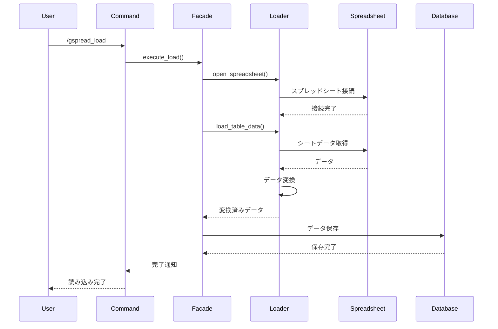
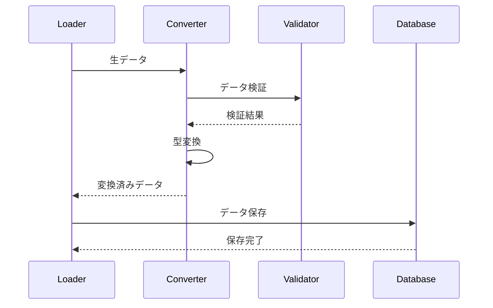

# Googleスプレッドシート読み込み機能 設計書

## 概要

Googleスプレッドシートに記載した設定データをBotの動作に反映させる機能です。スプレッドシートからデータを読み込み、データベースに保存することで、Botの設定やマスターデータを動的に更新できます。

## 機能要件

### 基本機能
- スプレッドシートからのデータ読み込み
- データベースへの一括保存
- テーブル定義に基づくデータ変換
- エラーハンドリングとログ出力
- 権限チェック（gbf_bot_controlロール必須）

### 対応データ種別
1. **クエスト情報**: クエスト名、別名、デフォルトバトル種類
2. **イベントスケジュール**: イベント種類、開催回数、期間
3. **イベントスケジュール詳細**: 通知メッセージ、スケジュール時間
4. **メッセージテキスト**: 多言語対応メッセージ
5. **環境設定**: Bot動作設定

### コマンド
- `/gspread_load`: スプレッドシートからデータ読み込み
- `/gspread_push`: データベースからスプレッドシートへ書き込み（将来実装）

## アーキテクチャ設計

### 層別責務

#### プレゼンテーション層（events/）
```
src/events/interactions/command_interactions/slash/gspread_load.rs
```
- スラッシュコマンドの定義
- 権限チェック
- エラーハンドリング
- ユーザーフィードバック

#### Facade層（facades/）
```
src/facades/spreadsheet/load_facade.rs
```
- スプレッドシート読み込み処理の統合
- トランザクション管理
- エラーハンドリング

#### Service層（services/）
```
src/services/spreadsheet/
├── loader_service.rs
├── converter_service.rs
└── validator_service.rs
```
- スプレッドシート読み込みロジック
- データ変換処理
- データ検証処理

#### Repository層（repository/）
```
src/repository/database/spreadsheet/
├── table_loader.rs
└── data_saver.rs
```
- データベース操作
- バルクインサート処理

## データモデル

### テーブル定義

#### GSpreadTableDefinition
```rust
pub struct GSpreadTableDefinition {
    pub table_name_jp: String,
    pub table_name_en: String,
    pub table_io: TableIO,
    pub table_cls: TypeId,
}

pub enum TableIO {
    Input,  // スプレッドシートから読み込み
    Output, // スプレッドシートへ書き込み
    Both,   // 双方向
}
```

#### データ変換結果
```rust
pub struct TableData {
    pub table_name: String,
    pub records: Vec<serde_json::Value>,
    pub row_count: usize,
    pub errors: Vec<ConversionError>,
}
```

### 対応テーブル一覧

| テーブル名（日本語） | テーブル名（英語） | 用途 | IO方向 |
|-------------------|------------------|------|--------|
| クエスト | quests | クエスト情報 | Input |
| クエスト別名 | quests_alias | クエスト別名 | Input |
| イベントスケジュール | event_schedules | イベントスケジュール | Input |
| イベントスケジュール詳細 | event_schedule_details | スケジュール詳細 | Input |
| メッセージ | messages | メッセージテキスト | Input |
| 環境設定 | environments | Bot設定 | Input |

## 処理フロー

### 1. データ読み込みフロー



### 2. データ変換フロー



## 実装詳細

### スプレッドシート読み込み

```rust
pub struct GSpreadLoader {
    core: Arc<GSpreadCore>,
    converter: Arc<DataConverter>,
    validator: Arc<DataValidator>,
}

impl GSpreadLoader {
    pub async fn open(&self) -> Result<()> {
        let book_url = env::var("GSPREAD_BOOK_LOAD_URL")?;
        self.core.open(book_url).await?;
        Ok(())
    }
    
    pub async fn load_all_tables(&self) -> Result<HashMap<String, TableData>> {
        let mut results = HashMap::new();
        
        for table_def in &self.core.table_definitions {
            if table_def.table_io != TableIO::Input {
                continue;
            }
            
            let worksheet = self.core.book.worksheet(&table_def.table_name_jp).await?;
            let raw_data = worksheet.get_all_records().await?;
            
            let converted_data = self.converter.convert_table(raw_data, table_def).await?;
            let validated_data = self.validator.validate_data(&converted_data).await?;
            
            results.insert(table_def.table_name_en.clone(), validated_data);
        }
        
        Ok(results)
    }
}
```

### データ変換

```rust
pub struct DataConverter;

impl DataConverter {
    pub async fn convert_table(
        &self,
        data: Vec<HashMap<String, String>>,
        table_def: &GSpreadTableDefinition,
    ) -> Result<Vec<serde_json::Value>> {
        let mut results = Vec::new();
        
        for (index, row) in data.iter().enumerate() {
            // 1行目は日本語列名のためスキップ
            if index == 0 {
                self.validate_columns(row, table_def).await?;
                continue;
            }
            
            let converted_row = self.convert_row(row, table_def).await?;
            results.push(converted_row);
        }
        
        Ok(results)
    }
    
    async fn convert_row(
        &self,
        row: &HashMap<String, String>,
        table_def: &GSpreadTableDefinition,
    ) -> Result<serde_json::Value> {
        let mut converted_row = serde_json::Map::new();
        
        for (col_name, value) in row {
            let converted_value = self.convert_value(value, col_name, table_def).await?;
            converted_row.insert(col_name.clone(), converted_value);
        }
        
        Ok(serde_json::Value::Object(converted_row))
    }
    
    async fn convert_value(
        &self,
        value: &str,
        col_name: &str,
        table_def: &GSpreadTableDefinition,
    ) -> Result<serde_json::Value> {
        // 型に応じた変換処理
        match self.get_column_type(col_name, table_def) {
            ColumnType::Integer => {
                let int_value = value.parse::<i32>()?;
                Ok(serde_json::Value::Number(int_value.into()))
            }
            ColumnType::BigInteger => {
                let bigint_value = value.parse::<i64>()?;
                Ok(serde_json::Value::Number(bigint_value.into()))
            }
            ColumnType::String => {
                Ok(serde_json::Value::String(value.to_string()))
            }
            ColumnType::DateTime => {
                let datetime = self.parse_datetime(value)?;
                Ok(serde_json::Value::String(datetime.to_rfc3339()))
            }
            ColumnType::UUID => {
                let uuid = value.parse::<uuid::Uuid>()?;
                Ok(serde_json::Value::String(uuid.to_string()))
            }
        }
    }
}
```

### データ保存

```rust
pub struct DataSaver {
    repository: Arc<SpreadsheetRepository>,
}

impl DataSaver {
    pub async fn save_all_tables(
        &self,
        session: &DatabaseTransaction,
        table_data: HashMap<String, TableData>,
    ) -> Result<()> {
        for (table_name, data) in table_data {
            self.save_table(session, &table_name, &data).await?;
        }
        Ok(())
    }
    
    async fn save_table(
        &self,
        session: &DatabaseTransaction,
        table_name: &str,
        data: &TableData,
    ) -> Result<()> {
        match table_name {
            "quests" => {
                let quests: Vec<Quest> = serde_json::from_value(
                    serde_json::Value::Array(data.records.clone())
                )?;
                self.repository.save_quests(session, &quests).await?;
            }
            "quests_alias" => {
                let aliases: Vec<QuestAlias> = serde_json::from_value(
                    serde_json::Value::Array(data.records.clone())
                )?;
                self.repository.save_quest_aliases(session, &aliases).await?;
            }
            "event_schedules" => {
                let schedules: Vec<EventSchedule> = serde_json::from_value(
                    serde_json::Value::Array(data.records.clone())
                )?;
                self.repository.save_event_schedules(session, &schedules).await?;
            }
            "event_schedule_details" => {
                let details: Vec<EventScheduleDetail> = serde_json::from_value(
                    serde_json::Value::Array(data.records.clone())
                )?;
                self.repository.save_event_schedule_details(session, &details).await?;
            }
            "messages" => {
                let messages: Vec<Message> = serde_json::from_value(
                    serde_json::Value::Array(data.records.clone())
                )?;
                self.repository.save_messages(session, &messages).await?;
            }
            "environments" => {
                let environments: Vec<Environment> = serde_json::from_value(
                    serde_json::Value::Array(data.records.clone())
                )?;
                self.repository.save_environments(session, &environments).await?;
            }
            _ => {
                warn!(table_name = %table_name, "未知のテーブル名です");
            }
        }
        Ok(())
    }
}
```

### コマンド実装

```rust
#[poise::command(
    slash_command,
    name = "gspread_load",
    description = "スプレッドシートからデータ読み込み"
)]
pub async fn gspread_load(
    ctx: PoiseContext<'_>,
) -> Result<()> {
    // 権限チェック
    if !check_gbf_bot_control_role(&ctx).await? {
        ctx.say("このコマンドを実行する権限がありません").await?;
        return Ok(());
    }
    
    ctx.defer().await?;
    
    let init_message = "スプレッドシートからデータ読み込み中...";
    ctx.say(init_message).await?;
    
    match execute_load(&ctx).await {
        Ok(_) => {
            ctx.say("スプレッドシートからデータ読み込み完了").await?;
        }
        Err(e) => {
            error!(error = %e, "スプレッドシート読み込みエラー");
            ctx.say("スプレッドシートからデータ読み込み失敗").await?;
        }
    }
    
    Ok(())
}

async fn execute_load(ctx: &PoiseContext<'_>) -> Result<()> {
    let app_state = &ctx.data().app_state;
    let txn = app_state.db().begin().await?;
    
    let result = async {
        let loader = GSpreadLoader::new();
        loader.open().await?;
        
        let table_data = loader.load_all_tables().await?;
        
        let saver = DataSaver::new();
        saver.save_all_tables(&txn, table_data).await?;
        
        // 後処理
        after_load(&txn).await?;
        
        Ok(())
    }.await;
    
    match result {
        Ok(_) => {
            txn.commit().await?;
            Ok(())
        }
        Err(e) => {
            txn.rollback().await?;
            Err(e)
        }
    }
}

async fn after_load(txn: &DatabaseTransaction) -> Result<()> {
    // 環境設定の再読み込み
    let env = EnvironmentSingleton::get();
    env.load_from_database(txn).await?;
    
    // スケジュールの再計算
    let schedule_manager = ScheduleManager::new();
    schedule_manager.event_schedule_clear(txn).await?;
    schedule_manager.event_schedule_create(txn).await?;
    
    Ok(())
}
```

## エラーハンドリング

### エラー種別

1. **SpreadsheetError**: スプレッドシート操作エラー
   - 接続エラー
   - シートアクセスエラー
   - データ読み込みエラー

2. **ConversionError**: データ変換エラー
   - 型変換エラー
   - データ形式エラー
   - 必須フィールド未入力

3. **DatabaseError**: データベース操作エラー
   - 接続エラー
   - トランザクションエラー
   - 制約違反エラー

### エラーレスポンス

```rust
match error {
    SpreadsheetError::ConnectionFailed => {
        error!("スプレッドシート接続に失敗しました");
    }
    ConversionError::InvalidDataType => {
        warn!(column = %col_name, "無効なデータ型です");
    }
    DatabaseError::ConstraintViolation => {
        error!("データベース制約違反が発生しました");
    }
    _ => {
        error!(error = %e, "不明なエラーが発生しました");
    }
}
```

## セキュリティ考慮事項

### 権限チェック
- `gbf_bot_control`ロールの必須
- スプレッドシートアクセス権限
- データベース書き込み権限

### データ検証
- 入力データのサニタイゼーション
- 型安全性の確保
- 必須フィールドの検証

### アクセス制御
- スプレッドシートURLの環境変数管理
- 認証情報の安全な管理
- ログ出力時の機密情報除外

## パフォーマンス考慮事項

### データ処理最適化
- バッチ処理による効率化
- 並行処理の活用
- メモリ使用量の最適化

### データベース最適化
- バルクインサートの活用
- トランザクション管理の最適化
- インデックスの適切な設定

### ネットワーク最適化
- 接続プールの管理
- タイムアウト設定の最適化
- リトライ機能の実装

## テスト戦略

### 単体テスト
- データ変換ロジックのテスト
- バリデーション処理のテスト
- エラーハンドリングのテスト

### 統合テスト
- スプレッドシート連携テスト
- データベース連携テスト
- エンドツーエンドテスト

### パフォーマンステスト
- 大量データ処理テスト
- 同時実行テスト
- メモリ使用量テスト

## 運用考慮事項

### ログ出力
```rust
info!("スプレッドシート読み込みを開始しました");
info!(table_name = %name, "テーブル読み込みが完了しました");
warn!(table_name = %name, "テーブルに無効な列名があります");
error!(error = %e, "スプレッドシート読み込みに失敗しました");
```

### 監視項目
- 読み込み成功率
- 処理時間
- エラー発生率
- データ整合性

### 障害対応
- 自動復旧機能
- フォールバック処理
- アラート通知

## 将来の拡張性

### 機能拡張
- 双方向同期機能
- 差分更新機能
- バックアップ機能
- 履歴管理機能

### 技術的拡張
- 他のスプレッドシートサービス対応
- リアルタイム同期
- イベント駆動アーキテクチャ
- マイクロサービス化
