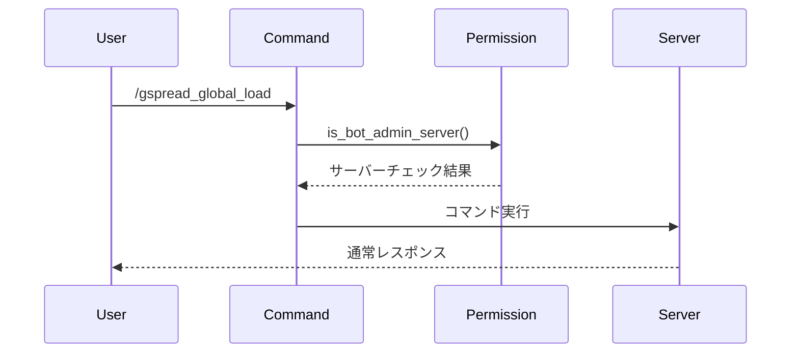
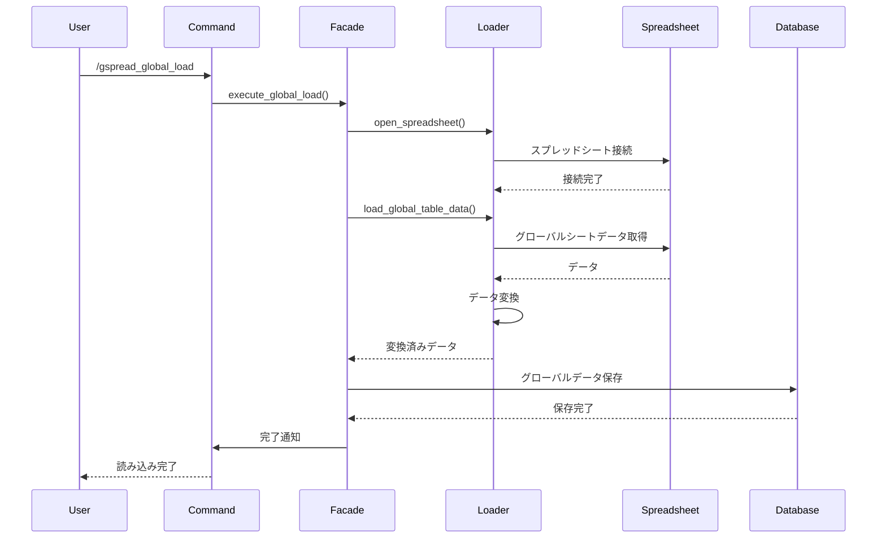
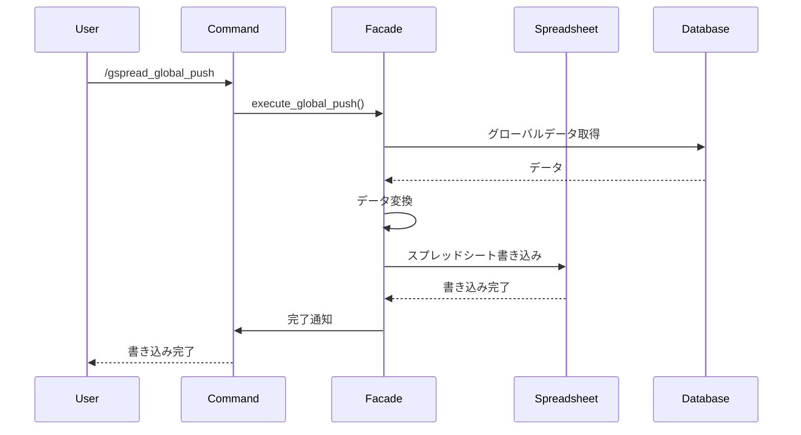

# Googleスプレッドシートグローバル機能 設計書

## 概要

Googleスプレッドシートの読み書き機能を、サーバー全体（グローバル）に影響するデータの管理を行います。

## 機能要件

### 基本機能
- スプレッドシートからのデータ読み込み（グローバル）
- データベースからスプレッドシートへの書き込み（グローバル）
- bot管理者専用の権限管理
- 他サーバーから見えないコマンド実行
- セキュアなログ出力

### 権限要件
- bot管理者専用サーバーの参加者のみ実行可能
- bot管理者専用サーバーでのみ表示
- 全てのレスポンスがephemeralでない（管理者専用サーバーの他ユーザーから見える）

### コマンド
- `/gspread_global_load`: スプレッドシートからデータ読み込み（管理者専用サーバー）
- `/gspread_global_push`: データベースからスプレッドシートへ書き込み（管理者専用サーバー）

## アーキテクチャ設計

### 層別責務

#### プレゼンテーション層（events/）
```
src/events/interactions/command_interactions/slash/
├── gspread_global_load.rs
└── gspread_global_push.rs
```
- スラッシュコマンドの定義
- 管理者専用サーバー権限チェック
- エラーハンドリング
- 通常レスポンス（ephemeralでない）

#### 権限管理層（services/permission/）
```
src/services/permission/mod.rs
```
- 管理者専用サーバー権限チェック
- 環境変数ベースのサーバー管理

#### Facade層（facades/）
```
src/facades/spreadsheet/global_load_facade.rs
src/facades/spreadsheet/global_push_facade.rs
```
- グローバルスプレッドシート処理の統合
- トランザクション管理
- エラーハンドリング

#### Service層（services/）
```
src/services/spreadsheet/
├── global_loader_service.rs
├── global_converter_service.rs
└── global_validator_service.rs
```
- グローバルスプレッドシート読み込みロジック
- データ変換処理
- データ検証処理

#### Repository層（repository/）
```
src/repository/database/spreadsheet/
├── global_table_loader.rs
└── global_data_saver.rs
```
- グローバルデータベース操作
- バルクインサート処理

## 権限システム設計

### 環境変数設定

#### 必要な環境変数
```bash
# Bot管理者専用サーバーのID
BOT_ADMIN_SERVER_ID=123456789012345678

# 読み込むスプレッドシートのURL
GSPREAD_BOOK_URL=https://docs.google.com/spreadsheets/d/xxxxxxxxxxxxxxxxxxxxxx
```

### 権限チェック実装

```rust
/// Checks if the current guild is the bot administrator server
pub async fn is_bot_admin_server(
    ctx: &PoiseContext<'_>,
) -> Result<bool, String> {
    let guild_id = ctx.guild_id()
        .ok_or("Guild ID not found")?
        .to_string();
    
    // 環境変数からbot管理者専用サーバーのIDを取得
    let admin_server_id = env::var("BOT_ADMIN_SERVER_ID")
        .unwrap_or_else(|_| String::new());
    
    if admin_server_id.is_empty() {
        return Ok(false);
    }
    
    Ok(guild_id == admin_server_id)
}
```

## 処理フロー

### 1. 権限チェックフロー



### 2. グローバルデータ読み込みフロー



### 3. グローバルデータ書き込みフロー



## 実装詳細

### グローバルスプレッドシート読み込み

```rust
#[poise::command(
    slash_command,
    name_localized("ja", "グローバル読み込み"),
    description_localized("ja", "スプレッドシートからデータ読み込み（管理者専用サーバー）")
)]
pub async fn gspread_global_load(ctx: PoiseContext<'_>) -> Result<()> {
    // 管理者専用サーバーかチェック
    let is_admin_server = is_bot_admin_server(&ctx).await
        .map_err(|e| {
            tracing::error!("Admin server check failed: {}", e);
            e
        })?;
    
    if !is_admin_server {
        ctx.say("このコマンドは管理者専用サーバーでのみ実行可能です").await?;
        return Ok(());
    }
    
    ctx.defer().await?;
    
    let init_message = "スプレッドシートからデータ読み込み中...";
    ctx.say(init_message).await?;
    
    tracing::info!("User {} started global spreadsheet load in admin server", ctx.author().id);
    
    match execute_global_load(&ctx).await {
        Ok(_) => {
            ctx.say("スプレッドシートからデータ読み込み完了").await?;
            tracing::info!("Global spreadsheet load completed successfully");
        }
        Err(e) => {
            tracing::error!(error = %e, "Global spreadsheet load failed");
            ctx.say("スプレッドシートからデータ読み込み失敗").await?;
        }
    }
    
    Ok(())
}
```

### グローバルスプレッドシート書き込み

```rust
#[poise::command(
    slash_command,
    name_localized("ja", "グローバル書き込み"),
    description_localized("ja", "データベースからスプレッドシートへ書き込み（管理者専用サーバー）")
)]
pub async fn gspread_global_push(ctx: PoiseContext<'_>) -> Result<()> {
    // 管理者専用サーバーかチェック
    let is_admin_server = is_bot_admin_server(&ctx).await
        .map_err(|e| {
            tracing::error!("Admin server check failed: {}", e);
            e
        })?;
    
    if !is_admin_server {
        ctx.say("このコマンドは管理者専用サーバーでのみ実行可能です").await?;
        return Ok(());
    }
    
    ctx.defer().await?;
    
    let init_message = "データベースからスプレッドシートへ書き込み中...";
    ctx.say(init_message).await?;
    
    tracing::info!("User {} started global spreadsheet push in admin server", ctx.author().id);
    
    match execute_global_push(&ctx).await {
        Ok(_) => {
            ctx.say("データベースからスプレッドシートへ書き込み完了").await?;
            tracing::info!("Global spreadsheet push completed successfully");
        }
        Err(e) => {
            tracing::error!(error = %e, "Global spreadsheet push failed");
            ctx.say("データベースからスプレッドシートへ書き込み失敗").await?;
        }
    }
    
    Ok(())
}
```

### グローバルデータ処理

```rust
async fn execute_global_load(ctx: &PoiseContext<'_>) -> Result<()> {
    let app_state = &ctx.data().app_state;
    let txn = app_state.db().begin().await?;
    
    let result = async {
        let loader = GlobalSpreadLoader::new();
        loader.open().await?;
        
        let global_table_data = loader.load_global_tables().await?;
        
        let saver = GlobalDataSaver::new();
        saver.save_global_tables(&txn, global_table_data).await?;
        
        // グローバル後処理
        after_global_load(&txn).await?;
        
        Ok(())
    }.await;
    
    match result {
        Ok(_) => {
            txn.commit().await?;
            Ok(())
        }
        Err(e) => {
            txn.rollback().await?;
            Err(e)
        }
    }
}

async fn execute_global_push(ctx: &PoiseContext<'_>) -> Result<()> {
    let app_state = &ctx.data().app_state;
    let txn = app_state.db().begin().await?;
    
    let result = async {
        let loader = GlobalDataLoader::new();
        let global_data = loader.load_from_database(&txn).await?;
        
        let pusher = GlobalSpreadPusher::new();
        pusher.push_to_spreadsheet(global_data).await?;
        
        Ok(())
    }.await;
    
    match result {
        Ok(_) => {
            txn.commit().await?;
            Ok(())
        }
        Err(e) => {
            txn.rollback().await?;
            Err(e)
        }
    }
}
```

## セキュリティ考慮事項

### 権限管理
- 環境変数による管理者専用サーバーの設定
- 管理者専用サーバー参加者全員に権限
- 非公開サーバーによるセキュリティ確保

### 可視性制御
- グローバルコマンドは管理者専用サーバーでのみ表示
- 全てのレスポンスが通常表示（管理者専用サーバーの他ユーザーから見える）
- 非公開サーバーによるアクセス制御

### ログセキュリティ
```rust
// ✅ 推奨: セキュアなログ出力
tracing::info!("User {} started global spreadsheet load in admin server", ctx.author().id);
tracing::info!("Global spreadsheet load completed successfully");

// ❌ 避けるべき: 機密情報のログ出力
tracing::info!("User {} started global spreadsheet load with data: {:?}", ctx.author().id, sensitive_data);
```

### アクセス制御
- スプレッドシートURLの環境変数管理
- 認証情報の安全な管理
- ログ出力時の機密情報除外

## エラーハンドリング

### エラー種別

1. **PermissionError**: 権限エラー
   - 管理者専用サーバー以外での実行
   - 環境変数未設定

2. **GlobalSpreadsheetError**: グローバルスプレッドシート操作エラー
   - 接続エラー
   - シートアクセスエラー
   - データ読み込みエラー

3. **GlobalDatabaseError**: グローバルデータベース操作エラー
   - 接続エラー
   - トランザクションエラー
   - 制約違反エラー

### エラーレスポンス

```rust
match error {
    PermissionError::NotAdminServer => {
        ctx.say("このコマンドは管理者専用サーバーでのみ実行可能です").await?;
    }
    GlobalSpreadsheetError::ConnectionFailed => {
        tracing::error!("グローバルスプレッドシート接続に失敗しました");
        ctx.say("スプレッドシート接続に失敗しました").await?;
    }
    GlobalDatabaseError::TransactionFailed => {
        tracing::error!("グローバルデータベーストランザクションに失敗しました");
        ctx.say("データベース操作に失敗しました").await?;
    }
    _ => {
        tracing::error!(error = %e, "不明なエラーが発生しました");
        ctx.say("予期しないエラーが発生しました").await?;
    }
}
```

## パフォーマンス考慮事項

### グローバルデータ処理最適化
- バッチ処理による効率化
- 並行処理の活用
- メモリ使用量の最適化

### データベース最適化
- グローバルデータのバルクインサート
- トランザクション管理の最適化
- インデックスの適切な設定

### ネットワーク最適化
- 接続プールの管理
- タイムアウト設定の最適化
- リトライ機能の実装

## テスト戦略

### 単体テスト
- 権限チェックロジックのテスト
- グローバルデータ変換ロジックのテスト
- エラーハンドリングのテスト

### 統合テスト
- bot管理者権限テスト
- グローバルスプレッドシート連携テスト
- グローバルデータベース連携テスト

### セキュリティテスト
- 権限昇格テスト
- 不正アクセステスト
- ログセキュリティテスト

## 運用考慮事項

### ログ出力
```rust
tracing::info!("User {} started global spreadsheet load in admin server", ctx.author().id);
tracing::info!("Global spreadsheet load completed successfully");
tracing::warn!("Global spreadsheet load failed for user {}", ctx.author().id);
tracing::error!(error = %e, "Global spreadsheet load failed");
```

### 監視項目
- 管理者専用サーバーでのコマンド実行回数
- グローバルデータ読み込み成功率
- 処理時間
- エラー発生率
- セキュリティイベント

### 障害対応
- 自動復旧機能
- フォールバック処理
- セキュリティアラート通知

## 将来の拡張性

### 機能拡張
- グローバル設定の動的変更
- 管理者専用サーバーの権限管理
- グローバルデータのバックアップ機能
- 履歴管理機能

### 技術的拡張
- 他のスプレッドシートサービス対応
- リアルタイム同期
- イベント駆動アーキテクチャ
- マイクロサービス化

### セキュリティ拡張
- 多要素認証
- 監査ログの強化
- セキュリティ監視の自動化
- 権限管理の細分化
