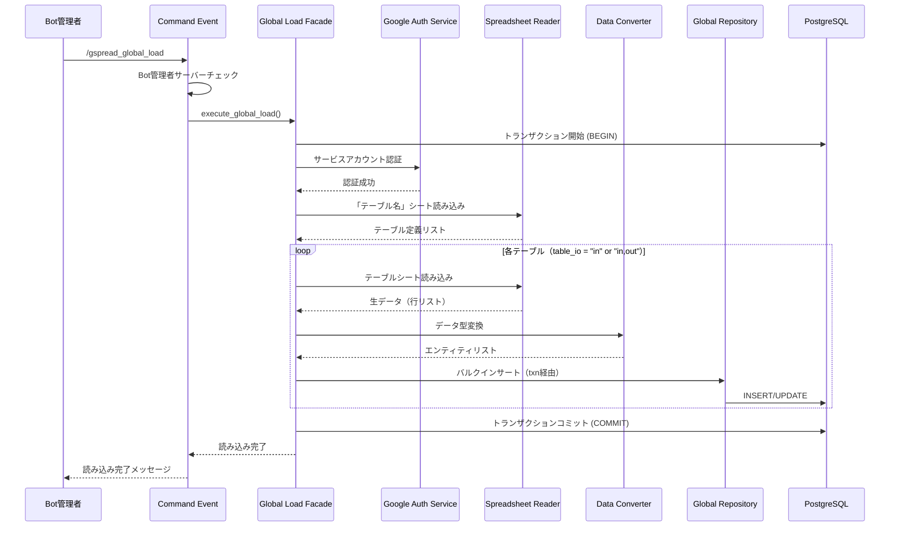
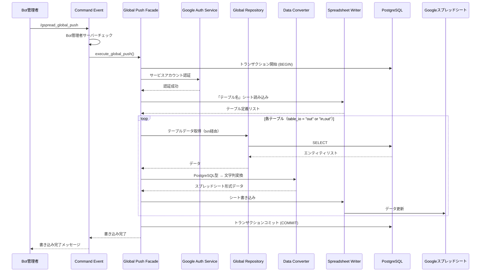
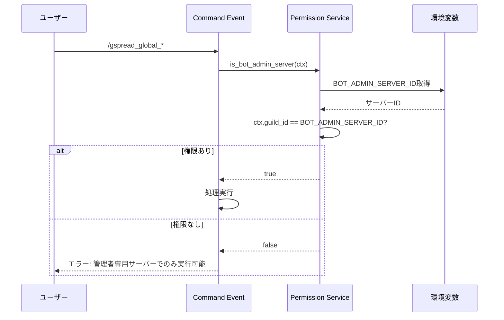

# Googleスプレッドシート グローバル機能 設計書

## 概要

Googleスプレッドシートを使用した**全ギルド共通データ（グローバルデータ）**の読み書き機能を提供します。Bot管理者専用サーバーでのみ実行可能で、全ギルドに影響を与えるマスターデータを管理します。

## 機能要件

### 基本機能

- **グローバルスプレッドシートからのデータ読み込み（インポート）**
  - スプレッドシート → PostgreSQL
  - 全ギルド共通の参照データを一括更新

- **PostgreSQLからグローバルスプレッドシートへのデータ書き込み（エクスポート）**
  - PostgreSQL → スプレッドシート
  - 現在のデータベース状態をスプレッドシートに同期

- **サービスアカウント認証**
  - Google Cloud Platform（GCP）サービスアカウントによる認証
  - 環境変数 `GOOGLE_SERVICE_ACCOUNT_KEY_FILE` でキーファイルのパスを指定

- **テーブル定義駆動処理**
  - スプレッドシート内の「テーブル名」シートでインポート/エクスポート対象を定義
  - テーブルごとにIO方向（in/out/both）を制御

### 権限要件

- **Bot管理者専用サーバー限定**
  - 環境変数 `BOT_ADMIN_SERVER_ID` で指定されたサーバーでのみコマンド実行可能
  - グローバルデータの変更は全ギルドに影響するため厳格な権限管理

- **レスポンス可視性**
  - 全てのレスポンスは通常メッセージ（ephemeralでない）
  - Bot管理者サーバー内の他メンバーも結果を確認可能

### 対象データ

グローバルテーブル（TableScopes.All）が対象：

| テーブル物理名 | テーブルタイプ | 説明 |
|-------------|------------|------|
| battle_types | Reference | マルチバトル戦術定義 |
| quests | Reference | クエスト情報 |
| quest_aliases | Reference | クエスト別名 |
| elements | Reference | 属性定義 |
| channel_types | Reference | チャンネル種類 |
| environments | Reference | 環境変数 |
| messages | Reference | メッセージ定義 |
| event_schedules | Reference | イベントスケジュール |
| event_schedule_details | Reference | イベント詳細スケジュール |
| last_process_times | History | 最終処理実行日時 |
| schedules | Transaction | 通知スケジュール |
| battle_recruitment_schedules | Transaction | マルチ募集スケジュール |

### コマンド

- `/gspread_global_load` - グローバルスプレッドシートからデータ読み込み（Bot管理者専用サーバー）
- `/gspread_global_push` - PostgreSQLからグローバルスプレッドシートへ書き込み（Bot管理者専用サーバー）

---

## アーキテクチャ設計

### 層別責務

本機能はクリーンアーキテクチャに準拠し、以下の層で実装されます。

```
events/ (Presentation)
   ↓
facades/ (Application)
   ↓
services/ (Business Logic)
   ↓
repository/ (Data Access)
```

#### プレゼンテーション層（events/）

**責務**: Discord UIとの接続、権限チェック、ユーザーフィードバック

**配置**:
```
src/events/interactions/command_interactions/slash/
├── gspread_global_load.rs
└── gspread_global_push.rs
```

**処理内容**:
- スラッシュコマンドの定義・登録
- Bot管理者専用サーバー権限チェック
- Facadeへの処理委譲
- エラーハンドリングとユーザーへのフィードバック

#### Facade層（facades/）

**責務**: 複数サービスの協調、トランザクション境界管理

**配置**:
```
src/facades/spreadsheet/
├── global_load_facade.rs
└── global_push_facade.rs
```

**処理内容**:
- **トランザクション管理**: begin/commit/rollback
- サービス層の組み合わせによるユースケース実現
- グローバルデータ読み込み後の後処理制御
- エラーハンドリングとロールバック

#### Service層（services/）

**責務**: 単一業務処理、ドメインルール実装

**配置**:
```
src/services/spreadsheet/
├── google_auth_service.rs       # Google認証サービス
├── spreadsheet_reader_service.rs # スプレッドシート読み込み
├── spreadsheet_writer_service.rs # スプレッドシート書き込み
├── table_definition_service.rs   # テーブル定義解析
├── data_converter_service.rs     # データ型変換
└── data_validator_service.rs     # データ検証
```

**処理内容**:
- Googleスプレッドシート認証とアクセス
- 「テーブル名」シートの解析
- 各テーブルシートのデータ読み書き
- データ型変換（文字列 ↔ PostgreSQL型）
- データ検証（必須項目、型整合性、外部キー制約）

#### Repository層（repository/）

**責務**: データ永続化・取得の抽象化

**配置**:
```
src/repository/database/spreadsheet/
├── global_table_repository.rs # グローバルテーブル操作
```

**処理内容**:
- トランザクション内でのバルクインサート
- テーブルごとのCRUD操作
- SeaORMエンティティとの変換

---

## スプレッドシート構成

### 1. 「テーブル名」シート（メタ情報定義）

このシートで対象テーブルと処理方向を定義します。

#### 列定義（固定）

| 列名 | 説明 | 値の例 |
|-----|------|-------|
| table_name_jp | テーブル日本語名（シート名として使用） | "クエスト情報" |
| table_name_en | テーブル物理名（PostgreSQLテーブル名） | "quests" |
| table_io | 処理方向 | "in", "out", "in,out" |
| table_type | テーブルタイプ | "reference", "transaction", "history" |

#### table_io の値

- `in`: スプレッドシート → PostgreSQL（読み込み専用）
- `out`: PostgreSQL → スプレッドシート（書き込み専用）
- `in,out`: 双方向（読み書き両対応）

#### サンプル

| table_name_jp | table_name_en | table_io | table_type |
|--------------|---------------|----------|------------|
| クエスト情報 | quests | in,out | reference |
| マルチバトル戦術 | battle_types | in | reference |
| イベントスケジュール | event_schedules | in,out | reference |

### 2. 各テーブルシート

テーブルごとに1シートを作成します。

#### シート構造

| 行番号 | 内容 | 説明 |
|-------|------|------|
| 1行目 | 列物理名 | PostgreSQLカラム名（完全一致必須） |
| 2行目 | 列日本語名 | 人間が理解しやすい列名（プログラムでは未使用） |
| 3行目以降 | データ行 | 実際のデータ |

#### 列名の扱い

- **1文字以上の列物理名**: DB登録対象
- **空文字または1文字未満**: DB登録対象外（メモ列などに使用可能）

#### サンプル（questsシート）

| target_id | recruit_count | quest_name | use_battle_type | default_battle_type | （メモ） |
|-----------|--------------|-----------|----------------|-------------------|---------|
| クエストID | 募集人数 | クエスト名 | 使用可能戦術 | デフォルト戦術 | 備考 |
| 1 | 30 | プロトバハムートHL | 1,2,3 | 1 | 青箱優先推奨 |
| 2 | 18 | アルティメットバハムートHL | 1,2 | 2 | トレハン優先 |

---

## 処理フロー

### 1. グローバルデータ読み込みフロー（/gspread_global_load）



### 2. グローバルデータ書き込みフロー（/gspread_global_push）



### 3. 権限チェックフロー



---

## データ変換設計

### PostgreSQL型 → スプレッドシート変換

| PostgreSQL型 | スプレッドシート表現 | 例 |
|------------|------------------|-----|
| Integer, BigInteger | 数値文字列 | "12345" |
| String, Text | そのまま | "クエスト名" |
| DateTime | RFC3339文字列 | "2025-01-15T12:00:00+09:00" |
| UUID | UUID文字列 | "550e8400-e29b-41d4-a716-446655440000" |
| Boolean | "true"/"false" | "true" |

### スプレッドシート → PostgreSQL型変換

逆変換時はバリデーションを実施：

- 数値: `parse::<i64>()`でパース、失敗時エラー
- 日時: 複数フォーマット対応（RFC3339, ISO8601, "YYYY-MM-DD HH:MM:SS"）
- UUID: `uuid::Uuid::parse_str()`でバリデーション
- 外部キー: 参照先テーブルの存在確認

---

## 認証設計

### サービスアカウント認証

Google Cloud Platformのサービスアカウントを使用したOAuth2認証を実施します。

#### 環境変数

```bash
# サービスアカウントキーファイルのパス
GOOGLE_SERVICE_ACCOUNT_KEY_FILE=/path/to/service-account-key.json
```

#### 推奨クレート

- **google-sheets4**: Google Sheets API v4 クライアント
- **yup-oauth2**: OAuth2認証ライブラリ

#### 認証フロー（概念）

1. `GOOGLE_SERVICE_ACCOUNT_KEY_FILE` からJSONキーを読み込み
2. `yup-oauth2` でサービスアカウント認証
3. `google-sheets4` でスプレッドシートアクセス
4. 必要なスコープ: `https://www.googleapis.com/auth/spreadsheets`

---

## エラーハンドリング

### エラー種別

| エラー種別 | 発生タイミング | ハンドリング |
|---------|-------------|------------|
| **PermissionError** | Bot管理者サーバー以外からの実行 | ユーザーにエラーメッセージ、処理中断 |
| **AuthenticationError** | Googleサービスアカウント認証失敗 | ログ出力、ユーザーにエラーメッセージ、処理中断 |
| **SpreadsheetNotFoundError** | スプレッドシートが見つからない | ログ出力、ユーザーにエラーメッセージ、処理中断 |
| **TableDefinitionError** | 「テーブル名」シートの形式不正 | ログ出力、ユーザーにエラーメッセージ、処理中断 |
| **DataConversionError** | データ型変換失敗 | エラー行をログ出力、該当行をスキップ、処理継続 |
| **DatabaseError** | PostgreSQL操作失敗 | トランザクションロールバック、ユーザーにエラーメッセージ |

### エラーレスポンス例

```
❌ エラー: このコマンドはBot管理者専用サーバーでのみ実行可能です

❌ エラー: Googleスプレッドシートへの接続に失敗しました
詳細はログを確認してください

❌ エラー: データ変換中にエラーが発生しました
- questsテーブル 5行目: recruit_count は数値である必要があります
```

### ログ出力（概念）

```rust
// ERROR: システムエラー、予期しない例外
tracing::error!(error = %e, "グローバルスプレッドシート接続に失敗しました");

// WARN: データ変換エラー（一部スキップ可能）
tracing::warn!(table = %table_name, row = %row_num, "データ変換エラー: {}", e);

// INFO: 重要な処理の開始・終了
tracing::info!("グローバルスプレッドシート読み込みを開始しました");
tracing::info!(table_count = %count, "グローバルデータ読み込みが完了しました");
```

---

## セキュリティ考慮事項

### アクセス制御

- **Bot管理者専用サーバー限定**: 環境変数による厳格な制御
- **サービスアカウントキーファイル**: ファイルシステム権限で保護（600）
- **スプレッドシートURL**: 環境変数で管理、ログに出力しない

### ログセキュリティ

機密情報をログに出力しない：

```rust
// ✅ 推奨
tracing::info!("グローバルスプレッドシート読み込み開始");

// ❌ 避けるべき
tracing::info!("スプレッドシートURL: {}", url); // URLは機密情報
```

### データ整合性

- **トランザクション管理**: Facade層での一貫したコミット/ロールバック
- **外部キー制約**: データ投入前の参照整合性チェック
- **バリデーション**: 必須項目、型整合性、範囲チェック

---

## パフォーマンス考慮事項

### バッチ処理最適化

- **バルクインサート**: 1行ずつではなく一括INSERT
- **並行処理**: 独立したテーブルは並行で処理（`futures::future::try_join_all`）
- **メモリ管理**: 大量データはストリーミング処理

### ネットワーク最適化

- **リトライ機能**: 一時的なネットワークエラーに対応
- **タイムアウト設定**: 長時間応答なしの場合は中断
- **接続プール**: Google APIクライアントの再利用

---

## テスト戦略

### 単体テスト

- **データ変換ロジック**: 各PostgreSQL型 ↔ 文字列変換
- **バリデーションロジック**: 不正データの検出
- **権限チェックロジック**: Bot管理者サーバー判定

### 統合テスト

- **モックスプレッドシート**: テスト用スプレッドシートでE2Eテスト
- **トランザクション**: ロールバック動作の確認
- **エラーハンドリング**: 各エラーケースの動作確認

---

## 運用考慮事項

### ログ出力（推奨レベル）

```rust
// INFO: 処理開始・終了
tracing::info!("グローバルスプレッドシート読み込みを開始しました");
tracing::info!(table_count = %count, "{}個のテーブルを読み込みました", count);

// WARN: 一部エラー（処理継続）
tracing::warn!(table = %table_name, "テーブル {} のデータ変換中にエラーがありました", table_name);

// ERROR: 致命的エラー（処理中断）
tracing::error!(error = %e, "グローバルスプレッドシート接続に失敗しました");
```

### 監視項目

- グローバルデータ読み込み成功率
- 処理時間（テーブルごと）
- データ変換エラー発生率
- 認証エラー発生回数

### バックアップ戦略

- **スプレッドシート**: Google Drive版履歴機能を活用
- **PostgreSQL**: 定期的なpg_dump

---

## 将来の拡張性

### 機能拡張

- **差分更新**: 全件更新ではなく差分のみ同期
- **バージョン管理**: スプレッドシート変更履歴の追跡
- **スケジュール実行**: 定期的な自動同期
- **通知機能**: 同期完了時のDiscord通知

### 技術的拡張

- **他スプレッドシートサービス対応**: Microsoft Excel Online等
- **リアルタイム同期**: Webhook経由の即時反映
- **マルチリージョン**: 複数のGCPプロジェクト対応

---

## 関連設計書

- [データベーステーブル設計書](../database/table_design.md)
- [Googleスプレッドシート ギルド機能 設計書](./google_spreadsheet_guild.md)
- [依存性注入アーキテクチャ](../architecture/dependency_injection.md)
