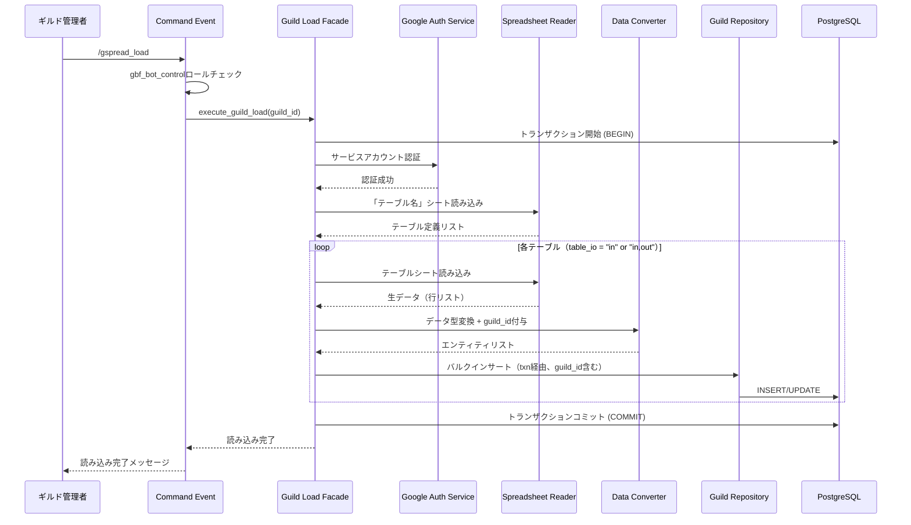
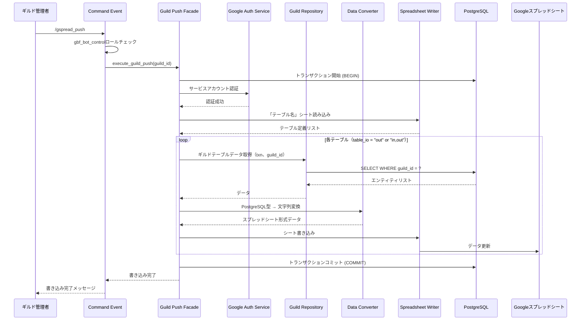
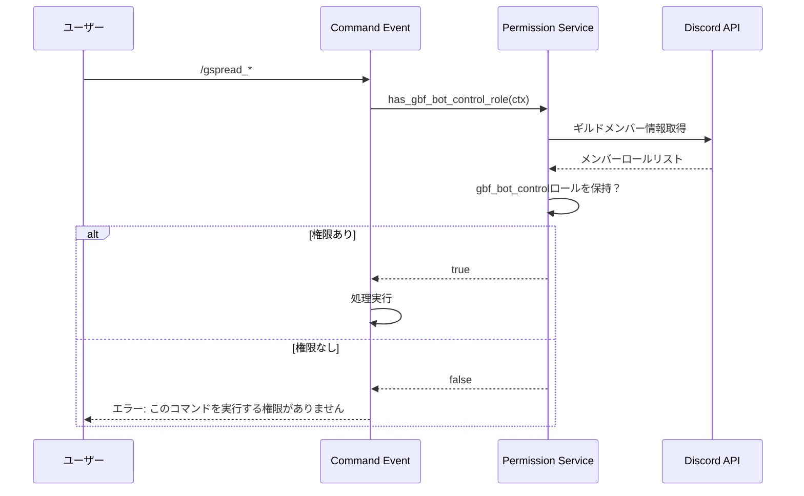

# Googleスプレッドシート ギルド機能 設計書

## 概要

Googleスプレッドシートを使用した**ギルド固有データ**の読み書き機能を提供します。各ギルドの管理者（gbf_bot_controlロール）が実行可能で、ギルド独自のカスタマイズデータを管理します。

## 機能要件

### 基本機能

- **ギルド固有スプレッドシートからのデータ読み込み（インポート）**
  - スプレッドシート → PostgreSQL
  - ギルド固有の参照データを一括更新

- **PostgreSQLからギルド固有スプレッドシートへのデータ書き込み（エクスポート）**
  - PostgreSQL → スプレッドシート
  - 現在のギルドデータベース状態をスプレッドシートに同期

- **サービスアカウント認証**
  - Google Cloud Platform（GCP）サービスアカウントによる認証
  - 環境変数 `GOOGLE_SERVICE_ACCOUNT_KEY_FILE` でキーファイルのパスを指定

- **テーブル定義駆動処理**
  - スプレッドシート内の「テーブル名」シートでインポート/エクスポート対象を定義
  - テーブルごとにIO方向（in/out/both）を制御

### 権限要件

- **gbf_bot_controlロール必須**
  - ギルド内でgbf_bot_controlロールを持つユーザーのみコマンド実行可能
  - ギルド固有データの変更は当該ギルドのみに影響

- **レスポンス可視性**
  - デフォルトは通常メッセージ（ephemeralでない）
  - 必要に応じてephemeral化も検討可能

### 対象データ

ギルドテーブル（TableScopes.Guild）とコミュニティテーブル（TableScopes.Community）が対象：

#### ギルド固有テーブル（Guild Scope）

| テーブル物理名 | テーブルタイプ | 説明 |
|-------------|------------|------|
| guild_environments | Reference | ギルド環境変数 |
| guild_messages | Reference | ギルドメッセージ定義 |
| guild_channels | Reference | ギルドチャンネル設定 |
| guild_event_schedules | Reference | ギルドイベントスケジュール |
| guild_event_schedule_details | Reference | ギルドイベント詳細スケジュール |
| guild_last_process_times | History | ギルド最終処理実行日時 |

#### コミュニティテーブル（Community Scope）

| テーブル物理名 | テーブルタイプ | 説明 |
|-------------|------------|------|
| battle_recruitments | Transaction | マルチバトル募集情報 |

**注意**: グローバルテーブルも読み込み可能ですが、ギルド固有スプレッドシートでは**ギルド固有テーブルのみ書き込み可能**です。

### データ参照優先順位

ギルド固有データとグローバルデータが両方存在する場合、**ギルド固有データが優先**されます：

```
データ取得時の優先順位：
1. ギルド固有テーブル（guild_*）を検索
2. 存在しない場合、グローバルテーブル（*）を検索
3. どちらにも存在しない場合、デフォルト値またはエラー
```

### コマンド

- `/gspread_load` - ギルド固有スプレッドシートからデータ読み込み（gbf_bot_controlロール必須）
- `/gspread_push` - PostgreSQLからギルド固有スプレッドシートへ書き込み（gbf_bot_controlロール必須）

---

## アーキテクチャ設計

### 層別責務

本機能はクリーンアーキテクチャに準拠し、以下の層で実装されます。

```
events/ (Presentation)
   ↓
facades/ (Application)
   ↓
services/ (Business Logic)
   ↓
repository/ (Data Access)
```

#### プレゼンテーション層（events/）

**責務**: Discord UIとの接続、権限チェック、ユーザーフィードバック

**配置**:
```
src/events/interactions/command_interactions/slash/
├── gspread_load.rs
└── gspread_push.rs
```

**処理内容**:
- スラッシュコマンドの定義・登録
- gbf_bot_controlロール権限チェック
- Facadeへの処理委譲
- エラーハンドリングとユーザーへのフィードバック

#### Facade層（facades/）

**責務**: 複数サービスの協調、トランザクション境界管理

**配置**:
```
src/facades/spreadsheet/
├── guild_load_facade.rs
└── guild_push_facade.rs
```

**処理内容**:
- **トランザクション管理**: begin/commit/rollback
- サービス層の組み合わせによるユースケース実現
- ギルドIDの受け渡し管理
- エラーハンドリングとロールバック

#### Service層（services/）

**責務**: 単一業務処理、ドメインルール実装

**配置**:
```
src/services/spreadsheet/
├── google_auth_service.rs       # Google認証サービス（グローバルと共通）
├── spreadsheet_reader_service.rs # スプレッドシート読み込み（グローバルと共通）
├── spreadsheet_writer_service.rs # スプレッドシート書き込み（グローバルと共通）
├── table_definition_service.rs   # テーブル定義解析（グローバルと共通）
├── data_converter_service.rs     # データ型変換（グローバルと共通）
└── data_validator_service.rs     # データ検証（グローバルと共通）
```

**処理内容**:
- Googleスプレッドシート認証とアクセス
- 「テーブル名」シートの解析
- 各テーブルシートのデータ読み書き
- データ型変換（文字列 ↔ PostgreSQL型）
- データ検証（必須項目、型整合性、外部キー制約、ギルドID整合性）

#### Repository層（repository/）

**責務**: データ永続化・取得の抽象化

**配置**:
```
src/repository/database/spreadsheet/
├── guild_table_repository.rs # ギルドテーブル操作
```

**処理内容**:
- トランザクション内でのバルクインサート（ギルドIDを含む）
- テーブルごとのCRUD操作
- SeaORMエンティティとの変換

---

## スプレッドシート構成

### 1. 「テーブル名」シート（メタ情報定義）

このシートで対象テーブルと処理方向を定義します。

#### 列定義（固定）

| 列名 | 説明 | 値の例 |
|-----|------|-------|
| table_name_jp | テーブル日本語名（シート名として使用） | "ギルドイベントスケジュール" |
| table_name_en | テーブル物理名（PostgreSQLテーブル名） | "guild_event_schedules" |
| table_io | 処理方向 | "in", "out", "in,out" |
| table_type | テーブルタイプ | "reference", "transaction", "history" |

#### table_io の値

- `in`: スプレッドシート → PostgreSQL（読み込み専用）
- `out`: PostgreSQL → スプレッドシート（書き込み専用）
- `in,out`: 双方向（読み書き両対応）

#### サンプル

| table_name_jp | table_name_en | table_io | table_type |
|--------------|---------------|----------|------------|
| ギルド環境変数 | guild_environments | in,out | reference |
| ギルドメッセージ定義 | guild_messages | in,out | reference |
| ギルドイベントスケジュール | guild_event_schedules | in,out | reference |

### 2. 各テーブルシート

テーブルごとに1シートを作成します。

#### シート構造

| 行番号 | 内容 | 説明 |
|-------|------|------|
| 1行目 | 列物理名 | PostgreSQLカラム名（完全一致必須） |
| 2行目 | 列日本語名 | 人間が理解しやすい列名（プログラムでは未使用） |
| 3行目以降 | データ行 | 実際のデータ |

#### 列名の扱い

- **1文字以上の列物理名**: DB登録対象
- **空文字または1文字未満**: DB登録対象外（メモ列などに使用可能）

#### guild_id の自動付与

ギルドテーブルには `guild_id` カラムが存在しますが、スプレッドシートでは以下の運用が可能：

1. **guild_idカラムを含める**: スプレッドシートに明示的に記載（他ギルドとのデータ共有時に便利）
2. **guild_idカラムを含めない**: システムが自動的に現在のギルドIDを付与

#### サンプル（guild_environmentsシート）

##### パターンA: guild_idを明示的に指定

| guild_id | key | value | memo | （メモ） |
|----------|-----|-------|------|---------|
| ギルドID | キー | 値 | 備考 | 補足 |
| 123456789012345678 | notification_channel | 987654321098765432 | 通知チャンネルID | |

##### パターンB: guild_idを省略（推奨）

| key | value | memo | （メモ） |
|-----|-------|------|---------|
| キー | 値 | 備考 | 補足 |
| notification_channel | 987654321098765432 | 通知チャンネルID | |

**推奨**: パターンBを使用し、システムが自動的にguild_idを付与する運用

---

## 処理フロー

### 1. ギルドデータ読み込みフロー（/gspread_load）



### 2. ギルドデータ書き込みフロー（/gspread_push）



### 3. 権限チェックフロー



---

## データ変換設計

### PostgreSQL型 → スプレッドシート変換

グローバル機能と同様：

| PostgreSQL型 | スプレッドシート表現 | 例 |
|------------|------------------|-----|
| Integer, BigInteger | 数値文字列 | "12345" |
| String, Text | そのまま | "メッセージ内容" |
| DateTime | RFC3339文字列 | "2025-01-15T12:00:00+09:00" |
| UUID | UUID文字列 | "550e8400-e29b-41d4-a716-446655440000" |
| Boolean | "true"/"false" | "true" |

### スプレッドシート → PostgreSQL型変換

逆変換時はバリデーションを実施：

- 数値: `parse::<i64>()`でパース、失敗時エラー
- 日時: 複数フォーマット対応（RFC3339, ISO8601, "YYYY-MM-DD HH:MM:SS"）
- UUID: `uuid::Uuid::parse_str()`でバリデーション
- 外部キー: 参照先テーブルの存在確認
- **guild_id**: 省略時は現在のギルドIDを自動付与

---

## 認証設計

### サービスアカウント認証

グローバル機能と同じ仕組みを使用します。

#### 環境変数

```bash
# サービスアカウントキーファイルのパス
GOOGLE_SERVICE_ACCOUNT_KEY_FILE=/path/to/service-account-key.json
```

#### 推奨クレート

- **google-sheets4**: Google Sheets API v4 クライアント
- **yup-oauth2**: OAuth2認証ライブラリ

---

## エラーハンドリング

### エラー種別

| エラー種別 | 発生タイミング | ハンドリング |
|---------|-------------|------------|
| **PermissionError** | gbf_bot_controlロール未保持 | ユーザーにエラーメッセージ、処理中断 |
| **AuthenticationError** | Googleサービスアカウント認証失敗 | ログ出力、ユーザーにエラーメッセージ、処理中断 |
| **SpreadsheetNotFoundError** | スプレッドシートが見つからない | ログ出力、ユーザーにエラーメッセージ、処理中断 |
| **TableDefinitionError** | 「テーブル名」シートの形式不正 | ログ出力、ユーザーにエラーメッセージ、処理中断 |
| **DataConversionError** | データ型変換失敗 | エラー行をログ出力、該当行をスキップ、処理継続 |
| **GuildIdMismatchError** | guild_idが現在のギルドと不一致 | ログ出力、該当行をスキップ、処理継続 |
| **DatabaseError** | PostgreSQL操作失敗 | トランザクションロールバック、ユーザーにエラーメッセージ |

### エラーレスポンス例

```
❌ エラー: このコマンドを実行する権限がありません
gbf_bot_controlロールが必要です

❌ エラー: Googleスプレッドシートへの接続に失敗しました
詳細はログを確認してください

❌ エラー: データ変換中にエラーが発生しました
- guild_environmentsテーブル 3行目: guild_idが現在のギルドと一致しません（スキップされました）
```

### ログ出力（概念）

```rust
// ERROR: システムエラー、予期しない例外
tracing::error!(guild_id = %guild_id, error = %e, "ギルドスプレッドシート接続に失敗しました");

// WARN: データ変換エラー（一部スキップ可能）
tracing::warn!(guild_id = %guild_id, table = %table_name, row = %row_num, "データ変換エラー: {}", e);

// INFO: 重要な処理の開始・終了
tracing::info!(guild_id = %guild_id, "ギルドスプレッドシート読み込みを開始しました");
tracing::info!(guild_id = %guild_id, table_count = %count, "ギルドデータ読み込みが完了しました");
```

---

## セキュリティ考慮事項

### アクセス制御

- **gbf_bot_controlロール必須**: Discordロールによる権限管理
- **ギルド分離**: 他ギルドのデータへのアクセス不可
- **サービスアカウントキーファイル**: ファイルシステム権限で保護（600）
- **スプレッドシートURL**: ギルドごとに環境変数で管理、ログに出力しない

### ログセキュリティ

機密情報をログに出力しない：

```rust
// ✅ 推奨
tracing::info!(guild_id = %guild_id, "ギルドスプレッドシート読み込み開始");

// ❌ 避けるべき
tracing::info!("スプレッドシートURL: {}", url); // URLは機密情報
```

### データ整合性

- **トランザクション管理**: Facade層での一貫したコミット/ロールバック
- **guild_idバリデーション**: 他ギルドのデータ混入を防止
- **外部キー制約**: データ投入前の参照整合性チェック
- **バリデーション**: 必須項目、型整合性、範囲チェック

---

## パフォーマンス考慮事項

### バッチ処理最適化

- **バルクインサート**: 1行ずつではなく一括INSERT
- **並行処理**: 独立したテーブルは並行で処理（`futures::future::try_join_all`）
- **メモリ管理**: 大量データはストリーミング処理

### ネットワーク最適化

- **リトライ機能**: 一時的なネットワークエラーに対応
- **タイムアウト設定**: 長時間応答なしの場合は中断
- **接続プール**: Google APIクライアントの再利用

---

## テスト戦略

### 単体テスト

- **データ変換ロジック**: 各PostgreSQL型 ↔ 文字列変換
- **guild_id自動付与ロジック**: 省略時の自動付与
- **バリデーションロジック**: 不正データの検出
- **権限チェックロジック**: gbf_bot_controlロール判定

### 統合テスト

- **モックスプレッドシート**: テスト用スプレッドシートでE2Eテスト
- **ギルド分離**: 複数ギルドのデータが混在しないことの確認
- **トランザクション**: ロールバック動作の確認
- **エラーハンドリング**: 各エラーケースの動作確認

---

## 運用考慮事項

### ログ出力（推奨レベル）

```rust
// INFO: 処理開始・終了
tracing::info!(guild_id = %guild_id, "ギルドスプレッドシート読み込みを開始しました");
tracing::info!(guild_id = %guild_id, table_count = %count, "{}個のテーブルを読み込みました", count);

// WARN: 一部エラー（処理継続）
tracing::warn!(guild_id = %guild_id, table = %table_name, "テーブル {} のデータ変換中にエラーがありました", table_name);

// ERROR: 致命的エラー（処理中断）
tracing::error!(guild_id = %guild_id, error = %e, "ギルドスプレッドシート接続に失敗しました");
```

### 監視項目

- ギルドデータ読み込み成功率（ギルドごと）
- 処理時間（テーブルごと）
- データ変換エラー発生率
- 認証エラー発生回数

### スプレッドシートURL管理

ギルドごとのスプレッドシートURLを管理する方法：

#### 方法A: 環境変数（小規模運用）

```bash
# ギルドID: 123456789012345678
GSPREAD_GUILD_123456789012345678_URL=https://docs.google.com/spreadsheets/d/xxx
```

#### 方法B: データベース管理（大規模運用）

`guild_environments` テーブルに `GSPREAD_URL` キーで保存：

| guild_id | key | value | memo |
|----------|-----|-------|------|
| 123456789012345678 | GSPREAD_URL | https://docs.google.com/... | ギルド固有スプレッドシートURL |

---

## グローバルデータとの統合

### データ参照の優先順位

アプリケーション層でのデータ取得時：

1. **ギルド固有テーブル（guild_*）を優先検索**
   - 例: `guild_messages` テーブルから `guild_id = X AND message_id = Y` を検索

2. **存在しない場合、グローバルテーブルを検索**
   - 例: `messages` テーブルから `message_id = Y` を検索

3. **どちらにも存在しない場合**
   - デフォルト値を使用、またはエラー

### 実装例（概念）

```rust
// Service層での実装イメージ
pub async fn get_message(
    txn: &DatabaseTransaction,
    guild_id: i64,
    message_id: &str,
) -> Result<String> {
    // 1. ギルド固有メッセージを検索
    if let Some(guild_message) = guild_message_repository
        .find_by_guild_and_id(txn, guild_id, message_id)
        .await?
    {
        return Ok(guild_message.message_jp);
    }

    // 2. グローバルメッセージを検索
    if let Some(global_message) = message_repository
        .find_by_id(txn, message_id)
        .await?
    {
        return Ok(global_message.message_jp);
    }

    // 3. 見つからない場合エラー
    Err(Error::MessageNotFound(message_id.to_string()))
}
```

---

## 将来の拡張性

### 機能拡張

- **差分更新**: 全件更新ではなく差分のみ同期
- **バージョン管理**: スプレッドシート変更履歴の追跡
- **スケジュール実行**: 定期的な自動同期
- **通知機能**: 同期完了時のDiscord通知
- **マルチスプレッドシート**: ギルド内で複数のスプレッドシートを管理

### 技術的拡張

- **他スプレッドシートサービス対応**: Microsoft Excel Online等
- **リアルタイム同期**: Webhook経由の即時反映
- **ギルド間データ共有**: 特定テーブルのみ他ギルドと共有

---

## 関連設計書

- [データベーステーブル設計書](../database/table_design.md)
- [Googleスプレッドシート グローバル機能 設計書](./google_spreadsheet_global.md)
- [依存性注入アーキテクチャ](../architecture/dependency_injection.md)
- [ロール・権限システム](../architecture/role_permission_system.md)
