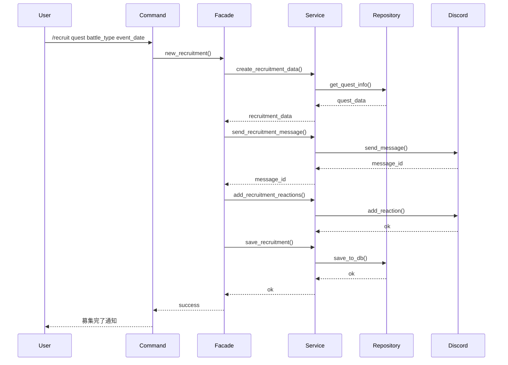
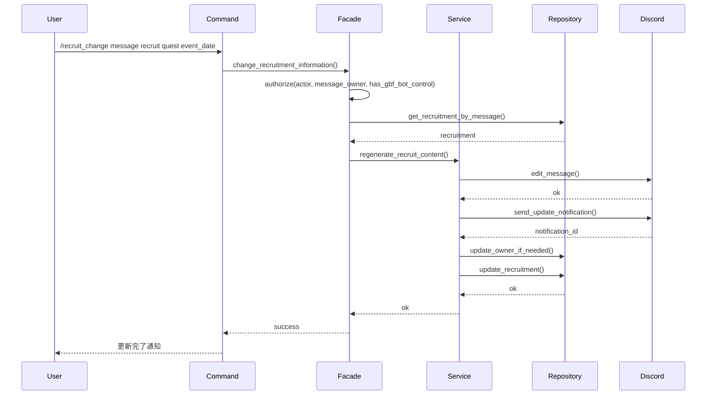
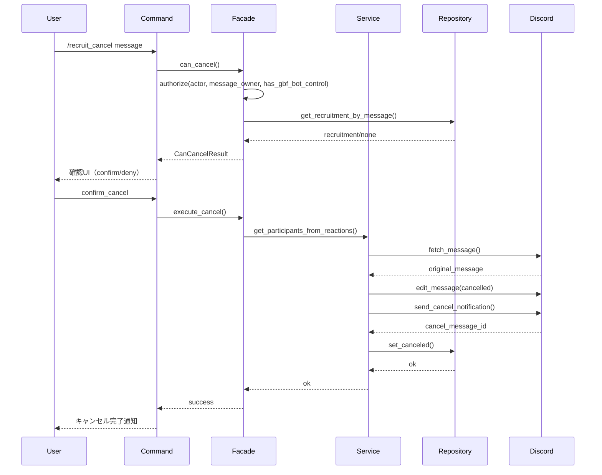
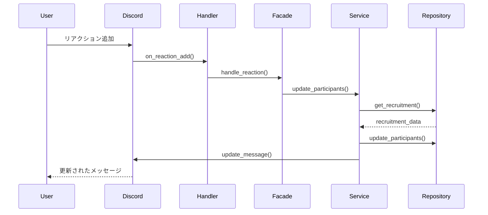

# クエスト募集機能 設計書

## 概要

Discordサーバー内でマルチバトルの参加者を募集する機能です。ユーザーがスラッシュコマンドで募集を開始し、リアクション機能により参加者を管理します。

## 機能要件

### 基本機能
- スラッシュコマンド `/recruit` による募集作成
- スラッシュコマンド `/recruit_change` による募集内容変更（実装中）
- スラッシュコマンド `/recruit_cancel` による募集キャンセル
- `gbf_bot_control` ロール保持者による募集の代理操作
- 募集主の引き継ぎ（募集変更でホストを再指定）
- クエスト別名によるオートコンプリート機能
- バトル種類の選択（DEFAULT, ALL_ELEMENT, SYSTEM, RELIC_BUSTER, SUPER_ULTIMATE_BAHAMUT）
- クエスト開始日時の設定（サーバーごとのデフォルト日時）
- バトル種類に応じたリアクション自動付与
- リアクションによる参加者管理
- 募集メッセージの自動更新

### 拡張機能
- 募集開始時の通知機能
- 参加者一覧の表示
- 募集終了時の自動処理

## アーキテクチャ設計

### 層別責務

#### プレゼンテーション層（events/）
```
src/events/interactions/command_interactions/slash/recruit_new.rs
src/events/interactions/command_interactions/slash/recruit_change.rs
src/events/interactions/command_interactions/slash/recruit_cancel.rs
```
- Discord API操作の実装
- スラッシュコマンドの定義
- オートコンプリート機能
- エラーハンドリング
- 変更・キャンセル時の確認UI制御

#### Facade層（facades/）
```
src/facades/recruitment/new_recruit.rs
src/facades/recruitment/change.rs
src/facades/recruitment/cancel.rs
```
- 複数サービス層の協調
- トランザクション境界管理
- Discord API操作の抽象化
- 変更・キャンセル結果の集約

#### Service層（services/）
```
src/services/recruitment/new.rs
src/services/recruitment/change.rs
src/services/recruitment/cancel.rs
```
- 募集データ作成のビジネスロジック
- メッセージ送信処理
- リアクション追加処理
- データ保存処理
- 募集内容変更時のDB更新・メッセージ更新（実装中）
- 募集キャンセル時のリアクション集計・通知

#### Repository層（repository/）
```
src/repository/database/
```
- 募集データの永続化
- クエスト情報の取得
- バトル種類の管理

## データモデル

### 主要エンティティ

#### BattleRecruitments
```rust
pub struct BattleRecruitments {
    pub id: i32,
    pub guild_id: i64,
    pub channel_id: i64,
    pub message_id: i64,
    pub host_discord_user_id: i64,
    pub target_id: i32,
    pub battle_type_id: i32,
    pub room_id: Option<String>,
    pub start_datetime: DateTime<Utc>,
    pub recruit_end_message_id: Option<i64>,
    pub is_canceled: bool,
    pub created_at: DateTime<Utc>,
    pub updated_at: DateTime<Utc>,
}
```

- `host_discord_user_id`: 現在の募集主のDiscordユーザーID。募集変更で引き継ぎが行われた場合はこの値を更新する。

#### Quest
```rust
pub struct Quest {
    pub id: i32,
    pub quest_name: String,
    pub quest_alias: String,
    pub default_battle_type: i32,
    pub weak_attribute: Option<i32>,
}
```

#### BattleType
```rust
pub enum BattleType {
    Default,
    AllElement,
    System,
    RelicBuster,
    SuperUltimateBahamut,
}

impl BattleType {
    /// バトル種類に応じたリアクションを取得
    pub fn get_reactions(&self) -> Vec<ReactionType> {
        match self {
            BattleType::Default => vec![ReactionType::Unicode("✋️".to_string())],
            BattleType::AllElement => vec![
                ReactionType::Unicode("🔴".to_string()), // 火
                ReactionType::Unicode("🔵".to_string()), // 水
                ReactionType::Unicode("🟤".to_string()), // 土
                ReactionType::Unicode("🟢".to_string()), // 風
                ReactionType::Unicode("🟡".to_string()), // 光
                ReactionType::Unicode("🟣".to_string()), // 闇
                ReactionType::Unicode("⚪️".to_string()), // 全属性対応
            ],
            BattleType::System => vec![ReactionType::Unicode("✋️".to_string())],
            BattleType::RelicBuster => vec![ReactionType::Unicode("✋️".to_string())],
            BattleType::SuperUltimateBahamut => vec![
                ReactionType::Unicode("🔴".to_string()), // 火
                ReactionType::Unicode("🔵".to_string()), // 水
                ReactionType::Unicode("🟤".to_string()), // 土
                ReactionType::Unicode("🟢".to_string()), // 風
                ReactionType::Unicode("🟡".to_string()), // 光
                ReactionType::Unicode("🟣".to_string()), // 闇
                ReactionType::Unicode("⚪️".to_string()), // 全属性対応
                ReactionType::Unicode("🔟".to_string()), // 10%担当
            ],
        }
    }
}
```

## コマンド設計

### `/recruit` 募集作成
- 入力: クエスト（必須）、開始日時（任意）、バトル種類（任意）
- 実行者: 募集を開始したいユーザー
- 処理概要:
  - Facadeでトランザクションを開始し、クエスト情報とバトル種類を解決
  - Discordに募集メッセージを送信し、リアクションを初期化
  - DBへ募集情報と募集主（実行者）のDiscordユーザーIDを保存
- 正常終了時: 募集メッセージをスレッド先頭に固定（将来検討）
- 異常系: DB保存失敗時はメッセージを削除しロールバック

### `/recruit_change` 募集内容変更（実装中）
- 入力:
  - 対象募集メッセージ
  - 更新後の募集テンプレート
  - クエスト
  - 出発日時
  - （将来）バトル種類
  - 新募集主（任意、Discordユーザー指定。未入力時は現募集主）
- 実行者: 募集作成者本人、または `gbf_bot_control` ロールを保持する管理者
- 処理方針:
  1. Facadeで実行者が募集主または管理者ロールを持つことを確認
  2. Facadeで対象メッセージとDBレコードを取得し、トランザクションを開始
  3. Service層で募集内容を再生成し、Discordメッセージを編集
  4. 新募集主が指定されている場合はDB上の募集主IDを更新し、内部キャッシュも同期
  5. 参加者にメンションを含む「募集内容が更新されました」通知を送信
  6. DBの募集情報（クエスト、開始日時、バトル種類、テンプレート）を更新
  7. 正常終了時にコミット、失敗時はロールバック

### `/recruit_cancel` 募集キャンセル
- 入力: 対象募集メッセージ
- 実行者: 募集作成者本人、または `gbf_bot_control` ロールを保持する管理者
- 処理概要:
  1. Facadeで実行者が募集主または管理者ロールを持つことを確認
  2. Facadeでキャンセル可否を判定（募集状態、メッセージ存在確認）
  3. ユーザーへ確認ダイアログを提示し、`confirm_cancel` ボタン押下で処理続行
  4. Service層でリアクションから参加者一覧を取得し、元メッセージに取り消し線と告知を追記
  5. 参加予定者をメンションしたキャンセル通知を返信として送信
  6. Repositoryで `is_canceled = true` とキャンセル通知メッセージIDを記録
  7. 成功時はコミット、エラー時はキャンセル中メッセージを削除してロールバック
- 異常系: 募集が既にキャンセル済み・メッセージ削除済みの場合はBusinessエラーを返し、ユーザーへwarnログを通知

## 処理フロー

### 1. 募集作成フロー



### 2. 募集内容変更フロー（計画）



### 3. 募集キャンセルフロー



### 4. リアクション処理フロー



## 実装詳細

### コマンド定義

```rust
#[poise::command(
    slash_command,
    name_localized("ja", "募集"),
    description_localized("ja", "バトル募集を作成します")
)]
pub async fn recruit(
    ctx: PoiseContext<'_>,
    #[description = "quest name or alias"]
    #[description_localized("ja", "クエスト名またはクエスト別名")]
    #[autocomplete = "quest_auto_complete"]
    quest: String,
    #[description = "Quest start date and time"]
    #[description_localized("ja", "クエスト開始日時")]
    start_datetime: String,
) -> Result<()> {
    // 実装
}
```

### 募集データ作成

```rust
pub async fn create_recruitment_data(
    quest_alias: &str,
    battle_type: BattleType,
    channel_id: u64,
    guild_id: u64,
    start_datetime: Option<DateTime<Local>>,
) -> types::Result<RecruitmentData> {
    // クエスト情報取得
    let quest = get_quest_by_alias(quest_alias).await?;
    
    // 開始日時計算（サーバーごとのデフォルト日時を使用）
    let start_time = start_datetime
        .map(|d| d.with_timezone(&chrono::Utc))
        .unwrap_or_else(|| get_default_start_datetime(guild_id));
    
    // メッセージ内容生成
    let message_content = create_message_content(&quest, &battle_type, &start_time);
    
    // Embed作成
    let embed = create_participants_embed();
    
    Ok(RecruitmentData {
        quest,
        battle_type,
        channel_id,
        guild_id,
        start_datetime: start_time,
        message_content,
        embed,
        reactions: battle_type.get_reactions(),
    })
}
```

- Facadeで取得した募集主IDを`BattleRecruitments.host_discord_user_id`として永続化し、引き継ぎ時は同フィールドを更新する。

### リアクション処理

```rust
pub async fn handle_reaction_add(
    ctx: &PoiseContext<'_>,
    reaction: &Reaction,
) -> types::Result<()> {
    // 募集情報取得
    let recruitment = get_recruitment_by_message(reaction.message_id).await?;
    
    // 参加者情報更新（全てのリアクションを対象）
    let participants = get_participants_from_all_reactions(&recruitment).await?;
    
    // メッセージ更新
    update_recruitment_message(ctx, &recruitment, &participants).await?;
    
    Ok(())
}

/// 全てのリアクションから参加者を取得
pub async fn get_participants_from_all_reactions(
    recruitment: &BattleRecruitments,
) -> types::Result<Vec<Participant>> {
    let message = get_message(recruitment.message_id).await?;
    let mut participants = Vec::new();
    
    // 全てのリアクションを取得
    for reaction in &message.reactions {
        for user in &reaction.users {
            if user.id != BOT_USER_ID {
                participants.push(Participant {
                    user_id: user.id,
                    reaction_emoji: reaction.emoji.to_string(),
                    added_at: chrono::Utc::now(),
                });
            }
        }
    }
    
    Ok(participants)
}
```

## エラーハンドリング

### エラー種別

1. **ValidationError**: 入力値検証エラー
   - 必須パラメータ未入力
   - 無効なクエスト開始日時形式
   - 存在しないクエスト

2. **DatabaseError**: データベース操作エラー
   - 接続エラー
   - トランザクションエラー

3. **DiscordError**: Discord API操作エラー
   - 権限不足
   - チャンネルアクセスエラー
   - リアクション取得エラー

### エラーレスポンス

```rust
match error {
    ValidationError::QuestNotFound => {
        ctx.say("指定されたクエストが見つかりません").await?;
    }
    ValidationError::InvalidStartDateTime => {
        ctx.say("クエスト開始日時の形式が正しくありません").await?;
    }
    DatabaseError::ConnectionFailed => {
        ctx.say("データベース接続エラーが発生しました").await?;
    }
    DiscordError::ReactionFetchFailed => {
        ctx.say("リアクション情報の取得に失敗しました").await?;
    }
    _ => {
        ctx.say("不明なエラーが発生しました").await?;
    }
}
```

## セキュリティ考慮事項

### 権限チェック
- サーバー内での募集作成権限
- チャンネル書き込み権限
- メッセージ管理権限

### 入力検証
- クエスト名のサニタイゼーション
- クエスト開始日時形式の検証
- 文字数制限の適用

### レート制限
- ユーザーあたりの募集作成頻度制限
- サーバーあたりの同時募集数制限

## パフォーマンス考慮事項

### データベース最適化
- インデックスの適切な設定
- クエリの最適化
- 接続プールの管理

### メモリ管理
- 大量データの効率的な処理
- キャッシュ戦略の実装

### 非同期処理
- 並行処理による応答性向上
- 適切なエラーハンドリング

## テスト戦略

### 単体テスト
- 各サービス層のロジックテスト
- データ変換処理のテスト
- エラーハンドリングのテスト

### 統合テスト
- データベース連携テスト
- Discord API連携テスト
- エンドツーエンドテスト

### パフォーマンステスト
- 大量データ処理テスト
- 同時接続テスト
- メモリ使用量テスト

## 運用考慮事項

### ログ出力
```rust
info!(quest_name = %quest_name, "募集作成を開始しました");
warn!(recruitment_id = %id, "募集が満員のため参加を拒否しました");
error!(error = %e, "募集作成に失敗しました");
```

### 監視項目
- 募集作成成功率
- リアクション処理時間
- データベース接続状況
- メモリ使用量

### 障害対応
- 自動復旧機能
- フォールバック処理
- アラート通知

## 将来の拡張性

### 機能拡張
- 募集の編集機能
- 募集の削除機能
- 募集履歴の表示
- 統計情報の提供
- サーバーごとのデフォルト開始日時設定
- バトル種類のカスタマイズ機能
- カスタムリアクションの設定
- リアクション別参加者統計
- 参加者一覧の詳細表示

### 技術的拡張
- マイクロサービス化
- イベント駆動アーキテクチャ
- リアルタイム通知機能
- スーパーアルティメットバハムート専用の最適化
- リアクション処理の最適化
- 参加者一覧表示の最適化
