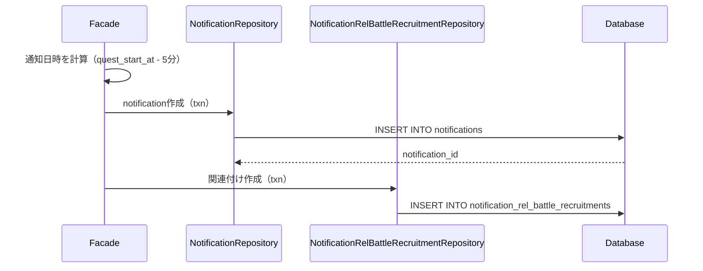
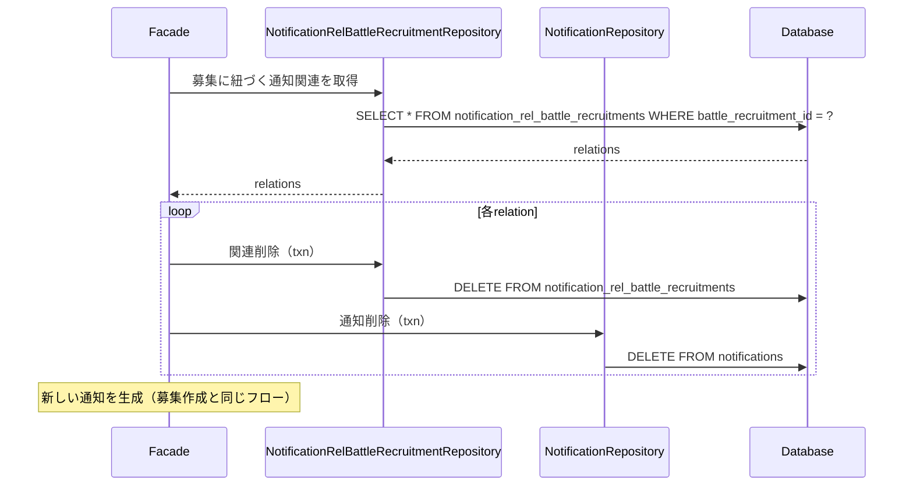

# 募集通知機能 設計書

## 概要

マルチバトル募集の通知機能を実装します。募集作成・変更時に、出発時刻の5分前に通知を送信するための`notifications`レコードを作成します。

## 背景

現在の募集通知は固定の`"RECRUIT_DEPARTURE_REMINDER"`メッセージIDを使用していますが、これを通知テーブル（`notifications`）で管理することで以下のメリットがあります：

1. **統一的な通知管理**: 全ての通知を`notifications`テーブルで一元管理
2. **時刻ベースの検索**: `schedule_datetime`で通知時刻を検索可能
3. **拡張性**: 複数の通知タイミング（5分前、10分前など）を容易に追加可能

## 重要な設計原則

### event_schedulesとの関係

- `event_schedules` / `event_schedule_details`: **スプレッドシート同期で作成される静的データ**（古戦場などのイベント）
- 募集は**動的に作成される**ため、`event_schedules`は作成しない
- 募集の通知は `notifications` のみを作成し、`notification_rel_battle_recruitments` で紐づける
- `notification_rel_event_schedules` は使用しない（イベントスケジュールベースではないため）

### 通知処理の流れ

1. 定期的に `notifications` テーブルを `schedule_datetime` で検索
2. 通知が見つかったら、関連テーブル（`notification_rel_battle_recruitments`など）で詳細情報を取得
3. メッセージテキストを取得して通知を送信

## 機能要件

### 基本機能

1. **募集作成時の通知生成**
   - 募集作成時に、出発日時 - 5分の通知を `notifications` テーブルに作成
   - `notification_rel_battle_recruitments` で募集と通知を紐づけ
   - `message_text_id` は `"RECRUIT_DEPARTURE_REMINDER"` 固定

2. **募集変更時の通知更新**
   - 出発日時が変更された場合、既存の通知を削除
   - 新しい出発日時 - 5分で通知を再生成

3. **通知の削除**
   - 募集キャンセル時に通知を削除
   - トランザクション内で確実に削除

## データモデル

### notifications（通知データ）

募集の通知を保存：

```rust
pub struct Notifications {
    pub id: i32,
    pub schedule_datetime: DateTime<Utc>, // 通知送信日時（出発時刻 - 5分）
    pub guild_id: i64,
    pub channel_id: i64,
    pub message_text_id: String,          // "RECRUIT_DEPARTURE_REMINDER"
    pub created_at: DateTime<Utc>,
    pub updated_at: DateTime<Utc>,
}
```

### notification_rel_battle_recruitments（通知と募集の関連）

```rust
pub struct NotificationRelBattleRecruitments {
    pub battle_recruitment_id: i32,    // battle_recruitmentsのid
    pub notification_id: i32,          // notificationsのid
    pub created_at: DateTime<Utc>,
}
```

### battle_recruitments（募集情報）

```rust
pub struct BattleRecruitments {
    pub id: i32,
    pub guild_id: i64,
    pub channel_id: i64,
    pub message_id: i64,
    pub quest_id: i32,
    pub battle_style_id: i32,
    pub quest_start_at: DateTime<Utc>,  // 出発日時
    pub is_recruiting: bool,
    pub is_canceled: bool,
    pub created_at: DateTime<Utc>,
    pub updated_at: DateTime<Utc>,
}
```

## アーキテクチャ設計

### 処理フロー

#### 1. 募集作成時の通知生成



#### 2. 募集変更時の通知更新



## 実装詳細

### 1. Facade層の実装（募集作成）

```rust
// src/facades/recruitment/new_recruit.rs

pub async fn new_recruitment(
    ctx: &PoiseContext<'_>,
    quest_alias: &str,
    battle_style_id: Option<i32>,
    event_date: Option<DateTime<Utc>>,
) -> types::Result<()> {
    // ... 既存の処理 ...

    // 募集データ保存
    let recruitment = new::save_recruitment(&txn, battle_recruitment_repo, &recruitment_data, message_id).await?;

    // 通知を作成（出発5分前）
    create_recruitment_notification(
        &txn,
        conn,
        recruitment.id,
        recruitment_data.expiry_date,
        guild_id,
        channel_id,
    ).await?;

    Ok(())
}

/// 募集用の通知を作成
async fn create_recruitment_notification(
    txn: &DatabaseTransaction,
    conn: &DatabaseConnection,
    recruitment_id: i32,
    departure_datetime: DateTime<Utc>,
    guild_id: u64,
    channel_id: u64,
) -> types::Result<()> {
    let notification_repo = NotificationRepository::new(conn.clone());
    let rel_repo = NotificationRelBattleRecruitmentRepository::new(conn.clone());

    // 通知日時を計算（出発5分前）
    let notification_datetime = departure_datetime - Duration::minutes(5);

    // notificationを作成
    let notification = notification_repo
        .create_with_txn(
            txn,
            notification_datetime,
            guild_id as i64,
            channel_id as i64,
            "RECRUIT_DEPARTURE_REMINDER".to_string(),
        )
        .await?;

    // notification_rel_battle_recruitmentsを作成
    rel_repo
        .create_with_txn(txn, recruitment_id, notification.id)
        .await?;

    Ok(())
}
```

### 2. Facade層の実装（募集変更）

```rust
// src/facades/recruitment/change.rs

// 出発日時が変更された場合、既存の通知を削除して新しい通知を作成
if event_date.is_some() {
    // 既存の通知を削除
    delete_recruitment_notification(
        &txn,
        app_state.db(),
        existing_recruitment.id,
    ).await?;

    // 新しい通知を作成
    create_recruitment_notification(
        &txn,
        app_state.db(),
        existing_recruitment.id,
        new_expiry_date,
        guild_id,
        channel_id,
    ).await?;
}

/// 募集用の通知を削除
async fn delete_recruitment_notification(
    txn: &DatabaseTransaction,
    conn: &DatabaseConnection,
    recruitment_id: i32,
) -> types::Result<()> {
    let rel_repo = NotificationRelBattleRecruitmentRepository::new(conn.clone());
    let notification_repo = NotificationRepository::new(conn.clone());

    // notification_rel_battle_recruitmentsから通知IDを取得
    let recruit_relations = rel_repo
        .find_by_recruit_id(recruitment_id)
        .await?;

    for relation in recruit_relations {
        // notificationを削除
        notification_repo
            .delete_by_id_with_txn(txn, relation.notification_id)
            .await?;

        // notification_rel_battle_recruitmentsを削除
        rel_repo
            .delete_by_notification_id_with_txn(txn, relation.notification_id)
            .await?;
    }

    Ok(())
}
```

## Repository層の実装

既存のRepositoryを使用します。新規実装は不要です。

- **NotificationRepository**: `src/repository/database/schedule/notifications.rs`（既存）
- **NotificationRelBattleRecruitmentRepository**: `src/repository/database/schedule/notification_rel_battle_recruitments.rs`（既存）

## テーブル関連図

```
battle_recruitments (募集情報)
├── id (i32, PK)
└── quest_start_at (出発日時)
    │
    ↓ (出発日時 - 5分で計算)
    │
notifications (通知データ)
├── id (i32, PK)
├── schedule_datetime (通知送信日時)
└── message_text_id = "RECRUIT_DEPARTURE_REMINDER"
    │
    ↓
notification_rel_battle_recruitments (関連付け)
├── battle_recruitment_id → battle_recruitments.id
└── notification_id → notifications.id
```

## エラーハンドリング

- 通知作成失敗時はロールバック
- 通知削除失敗時もロールバック
- トランザクション内で確実に実行

## テスト戦略

### 単体テスト

1. **通知日時計算のテスト**
   ```rust
   #[test]
   fn test_notification_datetime_calculation() {
       let departure = Utc.ymd(2024, 11, 24).and_hms(20, 0, 0);
       let notification = departure - Duration::minutes(5);
       assert_eq!(notification, Utc.ymd(2024, 11, 24).and_hms(19, 55, 0));
   }
   ```

2. **Repository層のテスト**
   - notification作成テスト
   - 関連付けテスト

### 統合テスト

1. **募集作成から通知までのフロー**
2. **募集変更時の通知更新**
3. **通知削除の整合性確認**

## 運用考慮事項

### 監視項目

- 通知生成成功率
- 通知送信成功率
- データベース整合性チェック

## 将来の拡張性

### 複数通知タイミングの追加

現在は5分前のみだが、以下のような通知を追加可能：

- 10分前通知
- 1時間前通知
- 前日通知

実装方法: `create_recruitment_notification` 関数で複数の通知を作成するだけ。
