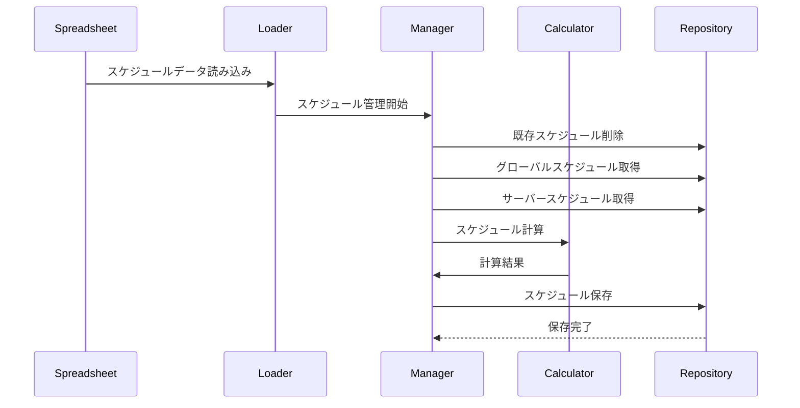
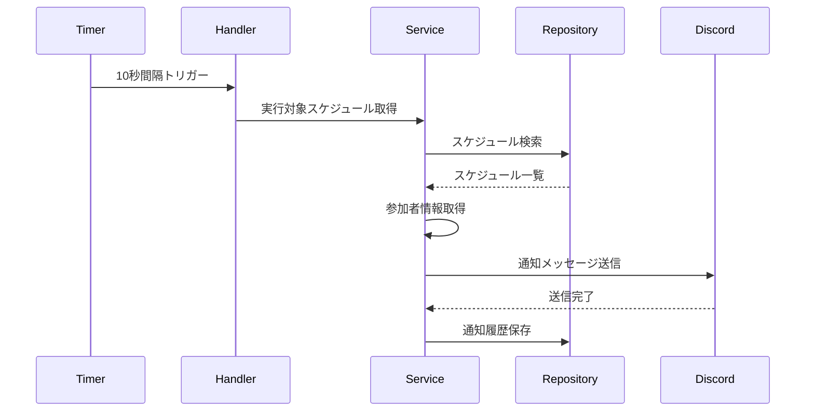

# スケジュール通知機能 設計書

> **⚠️ 警告: このドキュメントは古くなっています**
>
> このドキュメントに記載されているデータモデルとアーキテクチャは、大幅に変更されており、実装と乖離しています。
>
> **主な変更点:**
> - `Schedules` テーブル → `scheduled_tasks` テーブルに変更
> - `ScheduleTimer` → `SchedulerManager` に変更
> - テーブル構造とスケジュール管理方法が大きく変更
>
> **現在の実装:**
> - エンティティ: `src/models/entities/worker/scheduled_tasks.rs`
> - スケジューラー: `src/services/schedule/scheduler_manager.rs`
> - 詳細は [scheduler_manager_integration.md](../plans/scheduler_manager_integration.md) を参照してください
>
> このドキュメントは将来の改訂が必要です。

## 概要

Googleスプレッドシートの「イベントスケジュール」「イベントスケジュール詳細」シートを基に、定期的なスケジュール通知を実行する機能です。最大10秒程度の誤差が生じるため、秒単位でシビアな用途には他の手段を推奨します。

## 機能要件

### 基本機能
- スプレッドシートからのスケジュールデータ読み込み
- 定期的なスケジュールチェック（10秒間隔）
- イベント通知の自動送信
- 募集開始通知の自動送信
- 参加者へのメンション通知

### スケジュール種類
1. **グローバルイベント**: 全サーバー共通のイベント
2. **サーバー独自イベント**: サーバー固有のイベント
3. **グローバルイベント詳細**: グローバルイベントに紐づく詳細スケジュール
4. **サーバーイベント詳細**: サーバーイベントに紐づく詳細スケジュール

### 組み合わせパターン
| globalイベント | guildイベント | globalイベント詳細 | guildイベント詳細 | 結果 |
|------------|-----------|--------------|-------------|------|
| ○ | | ○ | | グローバルイベント |
| ○ | | | ○ | グローバルイベントにサーバー独自詳細追加 |
| | ○ | | ○ | サーバー独自イベント |

## アーキテクチャ設計

### 層別責務

#### プレゼンテーション層（events/）
```
src/events/handlers/schedule_handler.rs
```
- スケジュール実行のトリガー
- エラーハンドリング
- ログ出力

#### Facade層（facades/）
```
src/facades/schedule/notification_facade.rs
```
- スケジュール管理の協調
- 通知処理の統合
- トランザクション管理

#### Service層（services/）
```
src/services/schedule/
├── notification_service.rs
├── schedule_calculator.rs
└── message_service.rs
```
- スケジュール計算ロジック
- 通知メッセージ生成
- 参加者管理

#### Repository層（repository/）
```
src/repository/database/schedule/
├── event_schedules.rs
├── event_schedule_details.rs
└── notifications.rs
```
- スケジュールデータの永続化
- 通知履歴の管理

## データモデル

### 主要エンティティ

#### EventSchedules
```rust
pub struct EventSchedules {
    pub id: i32,
    pub event_type: String,
    pub event_count: i64,
    pub profile: String,
    pub weak_attribute: Option<i32>,
    pub start_at: DateTime<Utc>,
    pub end_at: DateTime<Utc>,
    pub created_at: DateTime<Utc>,
    pub updated_at: DateTime<Utc>,
}
```

#### EventScheduleDetails
```rust
pub struct EventScheduleDetails {
    pub id: i32,
    pub event_schedule_id: i32,
    pub profile: String,
    pub message_id: String,
    pub schedule_time: DateTime<Utc>,
    pub created_at: DateTime<Utc>,
    pub updated_at: DateTime<Utc>,
}
```

#### Notifications
```rust
pub struct Notifications {
    pub id: i32,
    pub schedule_datetime: DateTime<Utc>,
    pub guild_id: i64,
    pub channel_id: i64,
    pub message_text_id: String,
    pub created_at: DateTime<Utc>,
    pub updated_at: DateTime<Utc>,
}
```

#### Schedules
```rust
pub struct Schedules {
    pub id: i32,
    pub parent_schedule_id: Option<i32>,
    pub parent_schedule_detail_id: Option<i32>,
    pub schedule_datetime: DateTime<Utc>,
    pub guild_id: i64,
    pub channel_id: i64,
    pub message_id: String,
    pub created_at: DateTime<Utc>,
    pub updated_at: DateTime<Utc>,
}
```

## 処理フロー

### 1. スケジュール生成フロー



### 2. 通知実行フロー



## 実装詳細

### スケジュール管理

```rust
pub struct ScheduleManager {
    calculator: Arc<ScheduleCalculator>,
    repository: Arc<ScheduleRepository>,
}

impl ScheduleManager {
    pub async fn event_schedule_create(&self, session: &DatabaseTransaction) -> Result<()> {
        // 既存スケジュール削除
        self.repository.clear_schedules(session).await?;
        
        // 必要なデータを全取得
        let global_schedules = self.repository.get_global_schedules(session).await?;
        let global_details = self.repository.get_global_details(session).await?;
        let guild_schedules = self.repository.get_guild_schedules(session).await?;
        let guild_details = self.repository.get_guild_details(session).await?;
        let notification_channels = self.repository.get_notification_channels(session).await?;
        
        // スケジュール計算
        let schedules = self.calculator.calculate_schedules(
            global_schedules,
            global_details,
            guild_schedules,
            guild_details,
            notification_channels,
        ).await?;
        
        // スケジュール一括登録
        self.repository.bulk_insert_schedules(session, &schedules).await?;
        
        Ok(())
    }
}
```

### スケジュール計算

```rust
pub struct ScheduleCalculator;

impl ScheduleCalculator {
    pub async fn calculate_schedules(
        &self,
        global_schedules: Vec<EventSchedules>,
        global_details: Vec<EventScheduleDetails>,
        guild_schedules: Vec<GuildEventSchedules>,
        guild_details: Vec<GuildEventScheduleDetails>,
        notification_channels: Vec<GuildChannels>,
    ) -> Result<Vec<Schedules>> {
        let mut results = Vec::new();
        
        // グローバルイベント処理
        for schedule in global_schedules {
            let details = self.filter_details(&schedule, &global_details);
            let global_results = self.calculate_global_schedule(
                &schedule,
                &details,
                &notification_channels,
            ).await?;
            results.extend(global_results);
            
            // サーバー詳細との組み合わせ
            let guild_details_filtered = self.filter_guild_details(&schedule, &guild_details);
            let guild_results = self.calculate_guild_schedule(
                &schedule,
                &guild_details_filtered,
            ).await?;
            results.extend(guild_results);
        }
        
        // サーバー独自イベント処理
        for guild_schedule in guild_schedules {
            let guild_details_filtered = self.filter_guild_details(&guild_schedule, &guild_details);
            let guild_results = self.calculate_guild_schedule(
                &guild_schedule,
                &guild_details_filtered,
            ).await?;
            results.extend(guild_results);
        }
        
        Ok(results)
    }
}
```

### 通知実行

```rust
pub struct NotificationService {
    repository: Arc<NotificationRepository>,
    message_service: Arc<MessageService>,
}

impl NotificationService {
    pub async fn execute_scheduled_notifications(&self) -> Result<()> {
        let now = chrono::Utc::now();
        let schedules = self.repository.get_schedules_to_execute(now).await?;
        
        for schedule in schedules {
            self.execute_notification(&schedule).await?;
        }
        
        Ok(())
    }
    
    async fn execute_notification(&self, schedule: &Schedules) -> Result<()> {
        // メッセージ取得
        let message = self.repository.get_message(&schedule.message_id).await?;
        
        // 参加者情報取得（募集の場合）
        let mention = if let Some(recruitment_schedule) = &schedule.recruitment_schedule {
            self.get_participants_mention(recruitment_schedule).await?
        } else {
            String::new()
        };
        
        // 通知送信
        let channel = self.get_channel(schedule.channel_id).await?;
        let content = format!("{}{}", mention, message.content);
        
        let sent_message = channel.send_message(&content).await?;
        
        // リアクション追加
        if let Some(reactions) = &message.reactions {
            for reaction in reactions.split(',') {
                if !reaction.is_empty() {
                    sent_message.add_reaction(reaction).await?;
                }
            }
        }
        
        // 通知履歴保存
        self.repository.save_notification_history(schedule, &sent_message).await?;
        
        Ok(())
    }
}
```

### タイマー処理

```rust
pub struct ScheduleTimer {
    service: Arc<NotificationService>,
    interval: Duration,
}

impl ScheduleTimer {
    pub fn new(service: Arc<NotificationService>) -> Self {
        Self {
            service,
            interval: Duration::from_secs(10),
        }
    }
    
    pub async fn start(&self) -> Result<()> {
        let mut interval = tokio::time::interval(self.interval);
        
        loop {
            interval.tick().await;
            
            if let Err(e) = self.service.execute_scheduled_notifications().await {
                error!(error = %e, "スケジュール通知実行エラー");
            }
        }
    }
}
```

## エラーハンドリング

### エラー種別

1. **ScheduleError**: スケジュール処理エラー
   - スケジュール計算エラー
   - 通知実行エラー

2. **NotificationError**: 通知処理エラー
   - チャンネルアクセスエラー
   - メッセージ送信エラー

3. **DataError**: データ処理エラー
   - スプレッドシート読み込みエラー
   - データ変換エラー

### エラーレスポンス

```rust
match error {
    ScheduleError::CalculationFailed => {
        error!("スケジュール計算に失敗しました");
    }
    NotificationError::ChannelAccessDenied => {
        warn!(channel_id = %channel_id, "チャンネルアクセスが拒否されました");
    }
    DataError::SpreadsheetLoadFailed => {
        error!("スプレッドシート読み込みに失敗しました");
    }
    _ => {
        error!(error = %e, "不明なエラーが発生しました");
    }
}
```

## セキュリティ考慮事項

### 権限チェック
- 通知チャンネルへの書き込み権限
- スケジュール管理権限
- データ読み込み権限

### データ検証
- スケジュール日時の妥当性チェック
- メッセージ内容のサニタイゼーション
- 参加者情報の検証

### レート制限
- 通知送信頻度の制限
- 同時実行数の制限

## パフォーマンス考慮事項

### データベース最適化
- スケジュール検索のインデックス最適化
- バッチ処理による効率化
- 接続プールの管理

### メモリ管理
- 大量スケジュールデータの効率的処理
- キャッシュ戦略の実装

### 非同期処理
- 並行通知処理
- 適切なエラーハンドリング

## テスト戦略

### 単体テスト
- スケジュール計算ロジックのテスト
- 通知処理のテスト
- データ変換処理のテスト

### 統合テスト
- スケジュール生成から実行までのテスト
- データベース連携テスト
- Discord API連携テスト

### パフォーマンステスト
- 大量スケジュール処理テスト
- 同時通知実行テスト
- メモリ使用量テスト

## 運用考慮事項

### ログ出力
```rust
info!("スケジュール生成を開始しました");
info!(schedule_count = %count, "スケジュール生成が完了しました");
warn!(schedule_id = %id, "スケジュール実行に失敗しました");
error!(error = %e, "スケジュール処理でエラーが発生しました");
```

### 監視項目
- スケジュール実行成功率
- 通知送信成功率
- 処理時間
- メモリ使用量

### 障害対応
- スケジュール実行失敗時の再試行
- フォールバック処理
- アラート通知

## 将来の拡張性

### 機能拡張
- カスタム通知時間の設定
- 通知内容のカスタマイズ
- 統計情報の提供
- 通知履歴の管理

### 技術的拡張
- 分散スケジューリング
- イベント駆動アーキテクチャ
- リアルタイム通知機能
- マイクロサービス化
