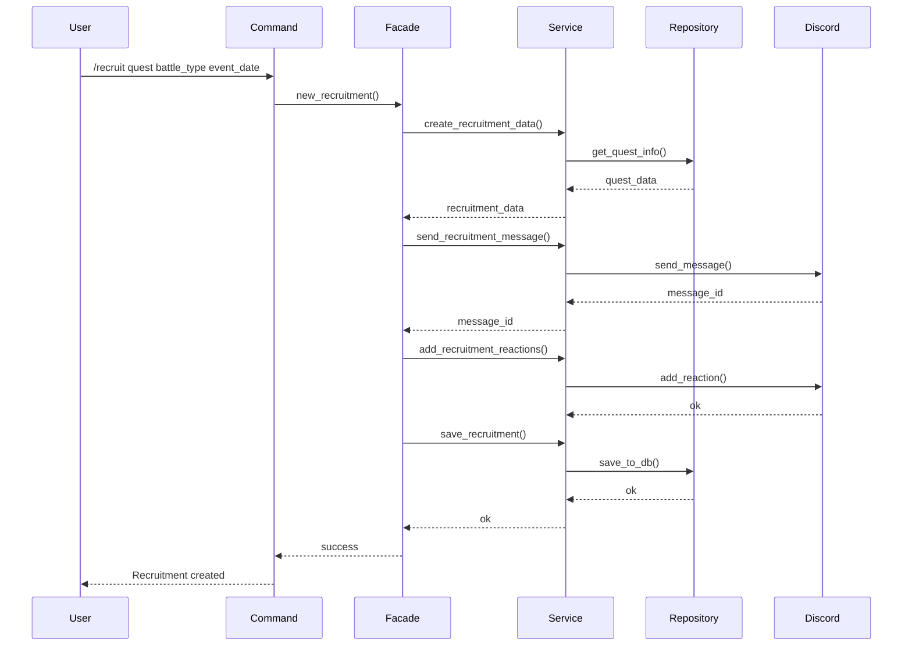
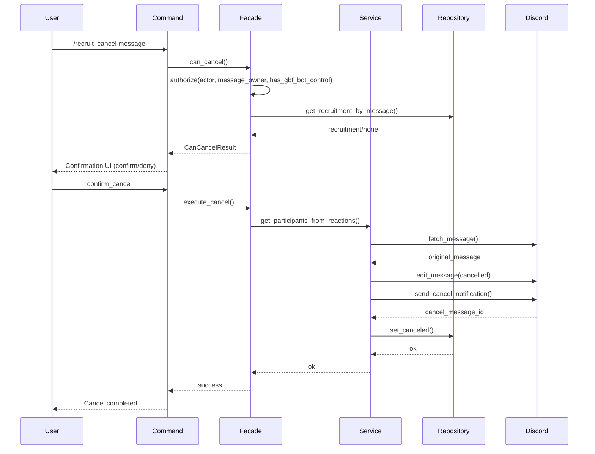
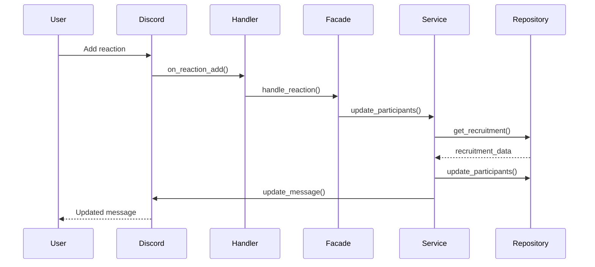

# Quest Recruitment Feature (Design)

## Overview

This feature recruits participants for multi battles within a Discord server. Users start a recruitment with slash commands, and participants are managed via reactions.

## Requirements

### Core features
- Create recruitments via `/recruit`
- Change recruitment details via `/recruit_change`
- Cancel recruitments via `/recruit_cancel`
- Proxy operations by users who have the `gbf_bot_control` role
- Transfer ownership (re-assign host during change)
- Autocomplete via quest aliases
- Select battle type (DEFAULT, ALL_ELEMENT, SYSTEM, RELIC_BUSTER, SUPER_ULTIMATE_BAHAMUT)
- Configure quest start date/time (server default supported)
- Auto-add reactions based on battle type
- Manage participants via reactions
- Auto-update recruitment message
- **Auto-cancel on message deletion**: if the recruitment message is deleted, the recruitment is automatically marked canceled

### Recurring recruitment
- Create schedules via `/定期募集作成`
- Delete schedules via `/定期募集削除`
- List schedules via `/定期募集一覧`
- Automatically create recruitment messages on specific weekdays/times
- Configure “recruit start time” and “departure time” separately
- Enable/disable schedules
- Only users with the `gbf_bot_control` role can change settings

### Extensions
- Notifications on recruitment start
- Display participant list
- Automatic post-processing on recruitment end
- Auto dissolution at departure time (dissolution)
- Auto dissolution due to insufficient participants (dismissal)

### Role mention notifications
- Register notification roles via `/recruit_role_add`
- Remove notification roles via `/recruit_role_remove`
- Auto-mention roles on recruitment messages (create/change/cancel)
- A role that is notified for all recruitments (quest-independent)
- Roles that are notified per quest (quest-dependent)
- Up to 6 roles can be registered at once
- Only users with the `gbf_bot_control` role can change settings

## Architecture

### Responsibilities by layer

#### Presentation layer (`events/`)
```
src/events/interactions/command_interactions/slash/recruit_new.rs
src/events/interactions/command_interactions/slash/recruit_change.rs
src/events/interactions/command_interactions/slash/recruit_cancel.rs
src/events/interactions/command_interactions/slash/recruit_role_add.rs
src/events/interactions/command_interactions/slash/recruit_role_remove.rs
src/events/interactions/command_interactions/slash/recurring_recruitment_create.rs
src/events/interactions/command_interactions/slash/recurring_recruitment_delete.rs
src/events/interactions/command_interactions/slash/recurring_recruitment_list.rs
src/events/message_delete.rs  # メッセージ削除イベントのハンドリング
```
- Implement Discord API operations
- Define slash commands
- Autocomplete
- Error handling
- Confirm/deny UI for change/cancel
- Authorization checks for role-setting commands
- Authorization checks for recurring recruitment commands
- Detect message deletion events and cancel recruitments

#### Facade layer (`facades/`)
```
src/facades/recruitment/new_recruit.rs
src/facades/recruitment/change.rs
src/facades/recruitment/cancel.rs
src/facades/recruitment/role_management.rs
```
- Coordinate multiple services
- Manage transaction boundaries
- Abstract Discord API operations
- Aggregate results for change/cancel
- Provide unified add/remove for notification role settings

#### Service layer (`services/`)
```
src/services/recruitment/new.rs
src/services/recruitment/change.rs
src/services/recruitment/cancel.rs
src/services/recruitment/role_notification.rs
```
- Business logic for creating recruitment data
- Send messages
- Add reactions
- Persist data
- Update DB and message on change (work in progress)
- Aggregate participants from reactions and send notifications on cancel
- Fetch notification roles and build mention strings
- Check duplicates and insert/delete role settings

#### Repository port layer (`repository/`)
```
src/repository/
src/repository/battle_recruitments_repository.rs
src/repository/recruitment_participants_repository.rs
src/repository/all_recruitment_notification_roles_repository.rs
src/repository/quest_recruitment_notification_roles_repository.rs
```
- Define contracts for recruitment persistence and notification-role persistence
- Define participant persistence contracts for recruitment buttons/reactions
- Keep service-facing interfaces independent from ORM
- `facades/recruitment/**` and `services/recruitment/**` must depend on traits re-exported from `crate::repository`

#### Infrastructure adapter layer (`infrastructure/database/repositories/`)
```
src/infrastructure/database/repositories/recruitment/
src/infrastructure/database/repositories/recruitment/battle_recruitments_repository.rs
src/infrastructure/database/repositories/recruitment/recruitment_participants_repository.rs
src/infrastructure/database/repositories/recruitment/all_recruitment_notification_roles_repository.rs
src/infrastructure/database/repositories/recruitment/quest_recruitment_notification_roles_repository.rs
```
- Implement persistence using SeaORM
- Persist recruitment data
- Persist recruitment participants
- Fetch quest information
- Manage battle types
- Persist notification role settings (all recruitments / per quest)
- Construct concrete repositories in `src/di/repositories.rs`, and inject them as trait-compatible dependencies

## Data model

### Primary entities

#### `BattleRecruitments`
```rust
pub struct BattleRecruitments {
    pub id: i32,
    pub guild_id: i64,
    pub channel_id: i64,
    pub message_id: i64,
    pub host_discord_user_id: i64,
    pub target_id: i32,
    pub battle_type_id: i32,
    pub room_id: Option<String>,
    pub start_datetime: DateTime<Utc>,
    pub recruit_end_message_id: Option<i64>,
    pub is_canceled: bool,
    pub created_at: DateTime<Utc>,
    pub updated_at: DateTime<Utc>,
}
```

- `host_discord_user_id`: the current host’s Discord user ID. Update this field when ownership is transferred via recruitment change.

#### `Quest`
```rust
pub struct Quest {
    pub id: i32,
    pub quest_name: String,
    pub quest_alias: String,
    pub default_battle_type: i32,
    pub weak_attribute: Option<i32>,
}
```

#### `BattleType`
```rust
pub enum BattleType {
    Default,
    AllElement,
    System,
    RelicBuster,
    SuperUltimateBahamut,
}

impl BattleType {
    /// バトル種類に応じたリアクションを取得
    pub fn get_reactions(&self) -> Vec<ReactionType> {
        match self {
            BattleType::Default => vec![ReactionType::Unicode("✋️".to_string())],
            BattleType::AllElement => vec![
                ReactionType::Unicode("🔴".to_string()), // 火
                ReactionType::Unicode("🔵".to_string()), // 水
                ReactionType::Unicode("🟤".to_string()), // 土
                ReactionType::Unicode("🟢".to_string()), // 風
                ReactionType::Unicode("🟡".to_string()), // 光
                ReactionType::Unicode("🟣".to_string()), // 闇
                ReactionType::Unicode("⚪️".to_string()), // 全属性対応
            ],
            BattleType::System => vec![ReactionType::Unicode("✋️".to_string())],
            BattleType::RelicBuster => vec![ReactionType::Unicode("✋️".to_string())],
            BattleType::SuperUltimateBahamut => vec![
                ReactionType::Unicode("🔴".to_string()), // 火
                ReactionType::Unicode("🔵".to_string()), // 水
                ReactionType::Unicode("🟤".to_string()), // 土
                ReactionType::Unicode("🟢".to_string()), // 風
                ReactionType::Unicode("🟡".to_string()), // 光
                ReactionType::Unicode("🟣".to_string()), // 闇
                ReactionType::Unicode("⚪️".to_string()), // 全属性対応
                ReactionType::Unicode("🔟".to_string()), // 10%担当
            ],
        }
    }
}
```

## Customizable element emojis

Element emojis used in recruitments (Fire/Water/Earth/Wind/Light/Dark) are customizable per server.

The 6 element emojis returned by `BattleType::get_reactions()` (🔴🔵🟤🟢🟡🟣) are the default. A server administrator can replace them by setting environment variables in the `guild_environments` table.

### Details

For detailed specs, technical implementation, and error handling, see:

- [guild_environments.md](../05_database/schema/guild_master/guild_environments.md)
- [security.md](../03_development_rules/security.md)

## Command design

### `/recruit` (create)
- Input: quest (required), start datetime (optional), battle type (optional)
- Actor: user who wants to create a recruitment
- Summary:
  - Start a transaction in the facade and resolve quest info and battle type
  - Send the recruitment message to Discord and initialize reactions
  - Persist recruitment info and the host (actor) Discord user ID to DB
- On success: pin the recruitment message to the top of the thread (future consideration)
- Failure: if DB persistence fails, delete the message and rollback

### `/recruit_change` (change) (work in progress)
- Input:
  - target recruitment message
  - updated recruitment template
  - quest
  - departure datetime
  - (future) battle type
  - new host (optional; Discord user. If omitted, keep the current host)
- Actor: the recruitment creator, or an admin with the `gbf_bot_control` role
- Policy:
  1. Facade verifies the actor is the host or has the admin role
  2. Facade fetches the target message and DB record, then begins a transaction
  3. Service re-generates recruitment content and edits the Discord message
  4. If a new host is specified, update host ID in DB and keep internal caches in sync
  5. Send a “recruitment updated” notification mentioning participants
  6. Update DB fields (quest, start datetime, battle type, template)
  7. Commit on success; rollback on failure

### `/recruit_cancel` (cancel)
- Input: target recruitment message
- Actor: the recruitment creator, or an admin with the `gbf_bot_control` role
- Summary:
  1. Facade verifies the actor is the host or has the admin role
  2. Facade determines whether cancel is allowed (recruitment state, message existence)
  3. Present a confirmation UI; continue when `confirm_cancel` is pressed
  4. Service collects participants from reactions and edits the original message (strike-through + note)
  5. Reply with a cancel notification mentioning participants
  6. Repository records `is_canceled = true` and the cancel notification message ID
  7. Commit on success; on error, delete “cancel in progress” message and rollback
- Failure: if already canceled or message was deleted, return a business error and notify the user via `warn` logging

### `/recruit_role_add` (add notification roles)
- Input:
  - quest (required; autocomplete; add an “すべて” item at the top)
  - role 1 (required)
  - role 2–6 (optional)
- Actor: only admins with the `gbf_bot_control` role
- Summary:
  1. Facade verifies the actor has the `gbf_bot_control` role
  2. If quest is “すべて” (internally `quest_id = 0`), insert into the all-recruitment notification role table
  3. If quest is a quest name, resolve quest ID and insert into the per-quest notification role table
  4. Validate roles exist on Discord (missing role → error)
  5. Skip roles already registered (treat as success)
  6. Bulk insert roles within a transaction
  7. Commit on success; rollback on failure
- Failure: missing roles → validation error and abort command

### `/recruit_role_remove` (remove notification roles)
- Input:
  - quest (required; autocomplete; add an “すべて” item at the top)
  - role 1 (required)
  - role 2–6 (optional)
- Actor: only admins with the `gbf_bot_control` role
- Summary:
  1. Facade verifies the actor has the `gbf_bot_control` role
  2. If quest is “すべて” (internally `quest_id = 0`), delete from the all-recruitment notification role table
  3. If quest is a quest name, resolve quest ID and delete from the per-quest notification role table
  4. Deleting non-existent roles is skipped (treated as success)
  5. Bulk delete roles within a transaction
  6. Commit on success; rollback on failure
- Failure: none (removing missing roles is still a success)

## Flows

### 1. Create recruitment flow



### 2. Change recruitment flow

Changing recruitment details is not provided in the current behavior, but the design keeps authorization checks and Discord message updates in the facade so it can be extended based on future requirements.

### 3. Cancel recruitment flow



### 4. Reaction handling flow



## Implementation details

### Command definition

```rust
#[poise::command(
    slash_command,
    name_localized("ja", "募集"),
    description_localized("ja", "バトル募集を作成します")
)]
pub async fn recruit(
    ctx: PoiseContext<'_>,
    #[description = "quest name or alias"]
    #[description_localized("ja", "クエスト名またはクエスト別名")]
    #[autocomplete = "quest_auto_complete"]
    quest: String,
    #[description = "Quest start date and time"]
    #[description_localized("ja", "クエスト開始日時")]
    start_datetime: String,
) -> Result<()> {
    // 実装
}
```

### Create recruitment data

```rust
pub async fn create_recruitment_data(
    quest_alias: &str,
    battle_type: BattleType,
    channel_id: u64,
    guild_id: u64,
    start_datetime: Option<DateTime<Local>>,
) -> types::Result<RecruitmentData> {
    // クエスト情報取得
    let quest = get_quest_by_alias(quest_alias).await?;

    // 開始日時計算（サーバーごとのデフォルト日時を使用）
    let start_time = start_datetime
        .map(|d| d.with_timezone(&chrono::Utc))
        .unwrap_or_else(|| get_default_start_datetime(guild_id));

    // メッセージ内容生成
    let message_content = create_message_content(&quest, &battle_type, &start_time);

    // Embed作成
    let embed = create_participants_embed();

    Ok(RecruitmentData {
        quest,
        battle_type,
        channel_id,
        guild_id,
        start_datetime: start_time,
        message_content,
        embed,
        reactions: battle_type.get_reactions(),
    })
}
```

- Persist the host ID obtained by the facade as `BattleRecruitments.host_discord_user_id`, and update the same field when ownership is transferred.

### Role mention handling

- Get notification roles when creating/changing/canceling recruitments
- Merge all-recruitment roles and per-quest roles
- Sort by `seq` (ascending)
- Generate mentions in Discord format `<@&role_id>`

### Buttons and select menu handling

#### Individual join buttons

Clicking an element button or a simple “join” button immediately executes the join action.

#### Multi-select menu (6 elements only)

For 6-element recruitments, an **element select menu** (`recruit_select_elements`) is provided in addition to individual buttons:

- Multiple elements can be selected at once (max 7: 6 elements + “all elements”)
- On confirm, join actions are executed immediately for all selected elements
- Similar to individual buttons, participation is persisted and the message is updated
- Selecting an element you already joined toggles it off (leave)
- If join and leave actions are mixed, display both messages

This prevents issues caused by consecutive clicks when users want to join 3+ elements.

##### Example responses

- Joined only: `✅ Joined with Fire, Water, Earth!`
- Left only: `👋 Left Fire and Water`
- Mixed:
  ```
  ✅ Joined with Fire and Water!
  👋 Left Earth and Wind
  ```

```rust
pub async fn handle_recruitment_select_menu(
    ctx: &Context,
    interaction: &ComponentInteraction,
    app_state: &AppState,
    element_ids: Vec<i32>,
) -> Result<()> {
    let mut joined_elements = Vec::new();
    let mut left_elements = Vec::new();

    // 選択された全ての属性で参加処理（トグル動作）
    for element_id in element_ids {
        let action = service.toggle_participation(
            &txn,
            recruitment.id,
            user_id,
            if element_id == 0 { None } else { Some(element_id) },
        ).await?;

        match action {
            ParticipationAction::Joined => joined_elements.push(element_name),
            ParticipationAction::Left => left_elements.push(element_name),
        }
    }

    // 参加と取り消しの両方のメッセージを生成
    let response_message = format_response_messages(joined_elements, left_elements);

    // メッセージを更新して参加者一覧を反映
    update_recruitment_message(ctx, &txn, &recruitment, message_id, channel_id).await?;

    Ok(())
}

/// 全てのリアクションから参加者を取得
pub async fn get_participants_from_all_reactions(
    recruitment: &BattleRecruitments,
) -> types::Result<Vec<Participant>> {
    let message = get_message(recruitment.message_id).await?;
    let mut participants = Vec::new();

    // 全てのリアクションを取得
    for reaction in &message.reactions {
        for user in &reaction.users {
            if user.id != BOT_USER_ID {
                participants.push(Participant {
                    user_id: user.id,
                    reaction_emoji: reaction.emoji.to_string(),
                    added_at: chrono::Utc::now(),
                });
            }
        }
    }

    Ok(participants)
}
```

## Error handling

### Error categories

1. **ValidationError**: invalid inputs
   - missing required parameters
   - invalid quest start datetime format
   - non-existent quest

2. **DatabaseError**: database operation failures
   - connection errors
   - transaction errors

3. **DiscordError**: Discord API failures
   - insufficient permissions
   - channel access errors
   - reaction fetch errors

### Example error responses

```rust
match error {
    ValidationError::QuestNotFound => {
        ctx.say("指定されたクエストが見つかりません").await?;
    }
    ValidationError::InvalidStartDateTime => {
        ctx.say("クエスト開始日時の形式が正しくありません").await?;
    }
    DatabaseError::ConnectionFailed => {
        ctx.say("データベース接続エラーが発生しました").await?;
    }
    DiscordError::ReactionFetchFailed => {
        ctx.say("リアクション情報の取得に失敗しました").await?;
    }
    _ => {
        ctx.say("不明なエラーが発生しました").await?;
    }
}
```

## Security considerations

### Authorization
- Create recruitment permission inside the server
- Channel write permission
- Message management permission

### Input validation
- Sanitize quest name
- Validate quest start datetime format
- Enforce length limits

### Rate limiting
- Per-user recruitment creation limits
- Per-guild concurrent recruitment limits

## Performance considerations

### Database
- Proper indexing
- Query optimization
- Connection pool management

### Memory
- Efficient handling of large datasets
- Cache strategy

### Async
- Improve responsiveness via concurrency
- Proper error handling

## Testing strategy

### Unit tests
- Service-level logic tests
- Data conversion tests
- Error handling tests

### Integration tests
- DB integration tests
- Discord API integration tests
- End-to-end tests

### Performance tests
- Large data processing tests
- Concurrency tests
- Memory usage tests

## Operational considerations

### Logging
```rust
info!(quest_name = %quest_name, "募集作成を開始しました");
warn!(recruitment_id = %id, "募集が満員のため参加を拒否しました");
error!(error = %e, "募集作成に失敗しました");
```

### Monitoring
- Recruitment creation success rate
- Reaction processing time
- DB connection status
- Memory usage

### Incident response
- Auto-recovery
- Fallback processing
- Alerting

## Future extensibility

### Feature extensions
- Edit recruitments
- Delete recruitments
- Show recruitment history
- Provide statistics
- Per-guild default start datetime setting
- Battle type customization
- Participation statistics per reaction
- Detailed participant list display

### Technical extensions
- Microservices
- Event-driven architecture
- Real-time notification
- Super Ultimate Bahamut optimizations
- Reaction processing optimizations
- Participant list display optimizations

## Auto dissolution due to insufficient participants (dismissal) — Detailed spec

### Goal

- Automatically dissolve recruitments that do not reach the required participant count before departure, and make the reason explicit to participants
- Keep consistency equivalent to normal cancellation while distinguishing the reason as “insufficient participants”

### Basic behavior

1. Allow specifying dismissal time(s) when creating a recruitment
2. At the specified time, check participant count
3. If below the required count, cancel the recruitment and send a dismissal notification
4. If the required count is reached, skip dismissal

### Input spec

- Parameter name: `dismissal_times`
- Input format: comma-separated string (with an upper bound)
- Absolute: time-only / datetime
- Relative: “n days/hours/minutes before departure” and equivalent English expressions

### Validation

- Ignore empty elements
- Error if exceeding the upper bound
- Error if any item cannot be parsed
- Error if the specified time exceeds the allowed range relative to the departure time
- Max range is controlled by env var `DISMISSAL_MAX_DAYS`

### Time interpretation rules

- If only time is specified, decide same-day/previous-day based on relative ordering to the departure time
- If only date is specified, treat it as end-of-day for that date
- If datetime is specified, use it as-is

### Runtime processing

- Triggered by `scheduled_tasks`
- Scheduler execution targets only tasks where `scheduled_tasks.execution_status = 'pending'`
- Re-check the recruitment state right before execution
- Reflect the execution result in `scheduled_tasks.execution_status` (`succeeded` / `succeeded_with_warning` / `failed`)
- If insufficient participants:
  - Update recruitment state to canceled
  - Update the recruitment message to show it is canceled
  - Send a dismissal notification message
  - Clean up related notification tasks

### Notification spec

- Clearly indicate the reason is “insufficient participants”
- Use a message ID that can be distinguished from normal cancellation notifications

### Data model references (appendix)

To avoid duplicate management, refer to these table definitions:

- [battle_recruitment_dismissals.md](../05_database/schema/worker/battle_recruitment_dismissals.md)
- [scheduled_task_dismissals.md](../05_database/schema/worker/scheduled_task_dismissals.md)
- [battle_recruitment_schedule_dismissals.md](../05_database/schema/guild_master/battle_recruitment_schedule_dismissals.md)

### Test considerations

- Input parsing (absolute/relative/multiple)
- Boundary cases for relative interpretation to departure time
- Skip when participant count meets requirement
- Cancellation/notification/task cleanup when insufficient participants
- Safe skip for already deleted/canceled recruitments

## Dismissal supplemental requirements (FR)

- FR-1: Target commands
  - Accept `dismissal_times` in one-off recruitment creation commands
  - Accept the same in recurring recruitment creation commands
- FR-2: Number of inputs
  - Allow multiple via comma separation
  - Ignore empty elements; error when exceeding the max count
- FR-3: Parse failures
  - If any item is not interpretable, return an error for the entire input
- FR-4: Range constraints
  - Reject times beyond the allowed range relative to the departure time
- FR-5: Execution-time judgment
  - Decide dismissal by participant count at execution time, after re-checking state
- FR-6: Notification expression
  - Distinguish from normal cancellation and explicitly indicate dismissal due to insufficient participants
