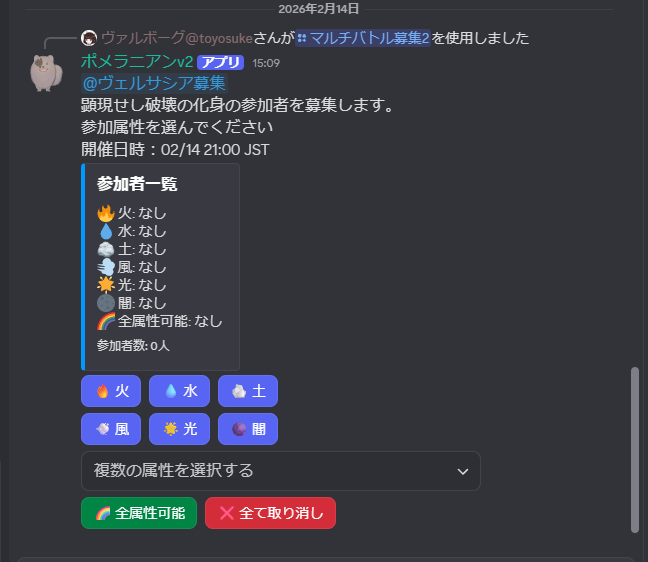

# Getting Started (User)

## What are Discord “slash commands”?

Type `/` in the chat box to open a menu of commands you can run for the bot.

## Try it first

1. Type `/` in the chat box

2. Select a bot command

3. Fill in the required fields as guided

4. Press Enter to send (run the command)

## Read next

- [Co-op recruitment](02_multi_recruitment.md)
- [Scheduled recruitment](03_scheduled_recruitment.md)
