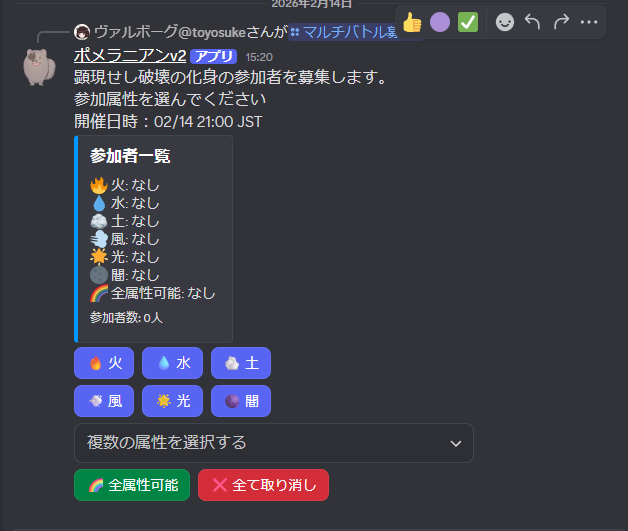

# マルチ募集（利用者向け）

マルチバトルの参加者を集めるための機能です。

## できること

- クエスト名と時間を指定して募集を出す
- 参加者はボタンやリアクションで参加できる（サーバー設定により見え方は変わります）

## まずやってみる（例）

1. チャット欄に `/` を入力
2. `/マルチバトル募集` （リアクション式）か `/マルチバトル募集2` （ボタン式） を選ぶ
3. 画面の入力欄に、クエスト名と時間を入れて送信

## クエスト日時入力のポイント

- 日付
  - 「2024-12-31」のようにISO形式
  - 「12/31」のようにスラッシュ区切り
  - 「12月31日」のように日本式
  - 「今日」「明日」など、日本語での記載
  - 「today」「tomorrow」など、英語の記載
- 時刻
  - 「21:00」のように24時間表記でコロン区切り
  - 「2200」数字4桁を時刻とみなす（例: 「2200」→「22:00」）
  - 「21時」「21時30分」「21時半」など日本式の記載

### クエスト日時の入力例

- 「2024-12-31 21:00」
- 「12/31 21:00」
- 「12月31日 21時」
- 「今日 21:00」
- 「明日 21時半」
- 「明日21時」
- 「明日22時半」
- 「tomorrow 2200」

## 何を入力すればいい？

### `/マルチバトル募集`（リアクション版） `/マルチバトル募集2`（ボタン版）

| 項目 | 必須 | 説明 |
|---|---:|---|
| クエスト名 | ✅ | 募集するクエスト（候補から選べます） |
| クエスト出発日時 | ✅ | 出発する日時 |
| マルチ攻略方法 | 任意 | 指定しない場合はクエストの標準設定が使われます |
| 解散時刻 | 任意 | 「1時間前, 21:00」のようにカンマ区切りで最大3つ |

## 募集をキャンセル

1. 募集メッセージを右クリック（スマホは長押し）
2. 「アプリ」→「募集キャンセル」

または

1. 募集メッセージを右クリック（スマホは長押し）
2. 「メッセージリンクをコピー」
3. スラッシュコマンド `/recruit_cancel` `/募集キャンセル` にメッセージリンクを貼り付けて実行

## 募集を30分遅らせる

出発時間だけを30分後ろにずらしたいときに使います。入力は不要です。

1. 募集メッセージを右クリック（スマホは長押し）
2. 「アプリ」→「募集を30分遅らせる」
3. 新しい出発日時が自分だけに表示され、募集メッセージも更新されます

> 出発通知や募集投稿の自動削除も、新しい出発日時に合わせて作り直されます。
>
> 既に出発時刻を過ぎた募集は遅らせられません。

## 募集を変更（内容を直す）

1. 募集メッセージを右クリック（スマホは長押し）
2. 「アプリ」→「募集内容変更」
3. 表示されたメニューで変更内容を選択・入力
  - クエスト: セレクトメニューで選択
  - 攻略方法: セレクトメニューで選択
  - 出発日時: 「出発日時を入力」ボタンから入力
4. `適用` ボタンを押すと変更が反映されます

または

1. 募集メッセージを右クリック（スマホは長押し）
2. 「メッセージリンクをコピー」
3. スラッシュコマンド `/recruit_change` `/マルチバトル募集内容変更` にメッセージリンクを貼り付けて実行
