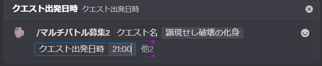

# はじめに（利用者向け）

## Discordの「スラッシュコマンド」とは

チャット欄に `/` を入力すると、Botに命令できるメニューが表示されます。

## まず試す

1. チャット欄に `/` を入力する

2. Botのコマンドを選ぶ

3. 画面の案内に従って必要な情報を入力

4. Enterキーで送信（コマンドを実行）

## 次に読む

- マルチ募集: `docs2/ja/利用者向け/02_マルチ募集.md`
- 定期募集: `docs2/ja/利用者向け/03_定期募集.md`
