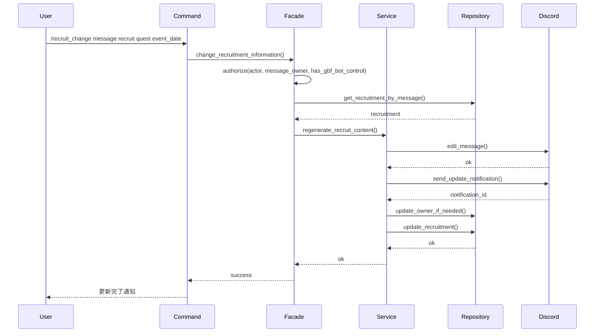

# 募集機能拡張計画

## 1. 概要

`docs/develop/features/quest_recruitment.md` に記載された現行仕様とは別に、募集内容変更フローなど将来的に追加を検討している機能計画を整理します。

## 2. 募集内容変更フロー（計画）

## 3. 運用メモ

- フロー実装時は Discord 権限確認とメッセージ編集 API の制約を再確認する。  
- 実装が進んだ場合は機能設計書を最新化し、本計画の該当部分を完了扱いに更新する。
